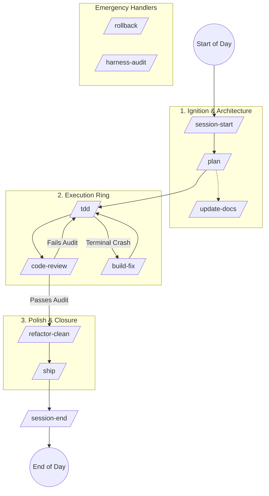

# 🤖 The Antigravity OS: AI Developer Guide

Welcome to the **IcyCrow** repository. To maintain high velocity without sacrificing code quality, we use a custom, deterministic AI workflow (The "Antigravity OS"). 

Instead of treating the AI as a generic chatbot, we treat it as a disciplined engineering team. We use specific **Commands** to force the AI through a strict CI/CD loop: Planning -> Test-Driven Execution -> Security Auditing -> Archiving.

- **Codemaps:** Located in `Docs/CODEMAPS/`. Use these for technical system overviews.
- **Feature Logs:** Located in `Docs/FEATURES/`. Every major Epic (Epic S20+) must include a feature log documenting technical architecture, UX flows, and maintenance requirements.
- **Session Archive:** Historical implementation plans are archived in `.agents/archive/plans/`.

### 🌟 Latest Feature: Emotional Design & Dino Companion
Transform the utility-first side panel into a living dashboard with a state-driven Dino mascot, sprite-sheet animations, and 100% pixel-perfect retro aesthetics. Including custom "Neural Link" wiring to AI chat states.

---

## 🗺️ The Core Workflow Diagram

This is the standard lifecycle of a feature in this repository. 

---

## 📖 Command Glossary: When & Where to Use Them

### 1. Session Management (Memory)
* **`/session-start`**
  * **When:** The absolute first thing you type when you open your IDE for the day.
  * **What it does:** Reads the handoff file from yesterday, creates today's Daily SSOT (Single Source of Truth), and aligns the AI's context.
* **`/session-end`**
  * **When:** The last thing you type before closing your laptop.
  * **What it does:** Compresses today's context into a handoff file, archives the day, and safely pushes to Git.

### 2. Architecture & Planning
* **`/plan`**
  * **When:** When starting a new feature or fixing a complex bug.
  * **What it does:** Breaks your request into a strict 4-Phase execution blueprint and commits a Git Restore Point. *Never write code without a plan.*
* **`/update-docs`**
  * **When:** After a major architectural change or at the end of a sprint.
  * **What it does:** Syncs the AI's internal codemaps and updates the human-readable `README.md` without destroying formatting.

### 3. Execution & Testing
* **`/tdd [Phase]`**
  * **When:** Immediately after `/plan` is approved.
  * **What it does:** The Builder agent. It reads the plan, writes a failing Vitest (RED), writes the minimal code to pass it (GREEN), checks coverage, and commits a Restore Point.
* **`/build-fix`**
  * **When:** When Vite, TypeScript, or Vitest throws a massive wall of red terminal errors.
  * **What it does:** The Paramedic agent. It reads the stack trace, surgically patches the exact missing import or type mismatch, and verifies the build passes.

### 4. Auditing & Quality
* **`/code-review`**
  * **When:** After `/tdd` finishes a phase or before opening a Pull Request.
  * **What it does:** The Auditor agent. It hunts for MV3 Service Worker bugs, memory leaks, and XSS vulnerabilities, fixes them automatically, and commits a Restore Point.
* **`/refactor-clean`**
  * **When:** When you suspect dead code, unused imports, or orphaned files are bloating the repo.
  * **What it does:** An atomic deletion loop that deletes dead code and verifies the build didn't break.

### 5. Emergency (The Time Machine)
* **`/rollback [Hash]`**
  * **When:** When the AI completely hallucinates or a feature breaks, and you need to undo.
  * **What it does:** Reverts the codebase to a previous Git hash *without* erasing the AI's memory of the daily session.

---

## 🛠️ Real-World Example: Building a "Tab Sync" Feature

Here is exactly what a 30-minute dev session looks like using this OS:

1. **Boot:** `> /session-start S1` *(AI wakes up, creates today's log).*
2. **Plan:** `> /plan Build a background worker that syncs tabs to chrome.storage.local` *(AI creates a 3-phase plan and commits Restore Point).*
3. **Execute Phase 1:** `> /tdd Phase 1` *(AI writes tests for the background worker, writes the code, tests pass, commits Restore Point).*
4. **Audit:** `> /code-review` *(AI notices the background worker lacks a keep-alive ping, adds it, tests it, commits Restore Point).*
5. **Close:** `> /ship` *(AI marks the feature as complete in the master docs).*
6. **Log off:** `> /session-end` *(AI creates the handoff for tomorrow and pushes to GitHub).*

---

## ⚠️ Important Contributor Rules
1. **Never edit `.agents/sessions/` files manually.** Let the AI manage its own memory.
2. **The Git Time Machine is your friend.** Every command prints a `[Short Hash]`. If a command goes rogue, just use `/rollback [Hash]` to instantly undo it.
3. **Keep the tree clean.** Do not run `/session-end` or `/refactor-clean` if you have uncommitted manual changes.