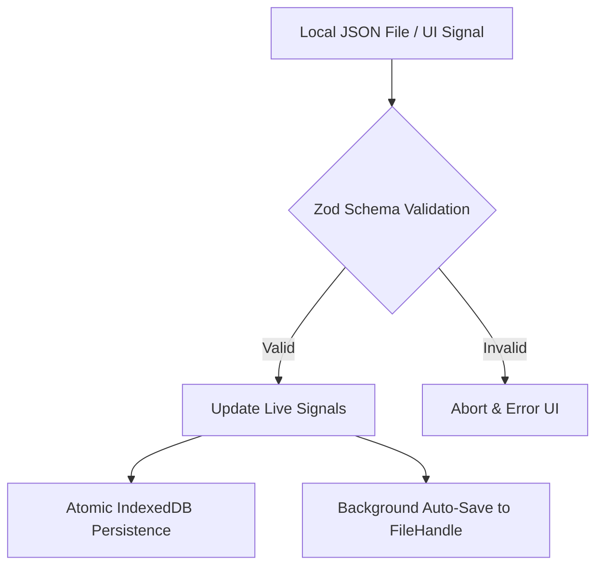

# FEATURE LOG: Workspace State Sync & Pro Auto-Save
[CREATED: 2026-03-28]

## Overview
The Workspace State Sync system allows users to treat their PDF annotations as portable, editable assets. Unlike flat PDF exports, these JSON-based workspaces preserve the full interactivity of highlights, ink, sticky notes, and callouts.

## Core Architecture
The system follows a strict **Validation-before-Persistence** pipeline:

### Components
1. **StateSyncService.ts**: The functional core. 
   - Handles serialization/deserialization.
   - Enforces the `WorkspacePayload` schema.
   - Manages the `WorkspaceRegistry` in `chrome.storage.local`.
2. **WorkspaceImportModal.tsx**: A glassmorphic "Safety Net" that previews incoming data and warns about document/page count mismatches.
3. **WorkspaceRecommendation.tsx**: A persistent background sentinel that suggests restoring orphaned sessions based on the document URL registry.

## Pro Tier: Auto-Save
Leveraging the **File System Access API**, IcyCrow can "lock" a document to a local file.
- **Workflow**: `Link Output File` -> `Browser Picker` -> `Persistent Permission`.
- **Logic**: A background `effect` in `ToolbarManager.tsx` debounces (2s) changes to the annotation signals and silently writes to the file handle.
- **UX**: Displays a "Sync Active" indicator in the settings modal with the linked filename.

## Security & Privacy
- **100% Local**: No external API calls are made. 
- **Zod Enforcement**: Prevents cross-site scripting or data corruption through malicious JSON injection.
- **Sandboxed Handles**: Access to the local file is restricted to the specific handle granted by the user.

## Future Maintenance
- When adding new annotation types (e.g., shapes, OCR blocks), they **MUST** be added to the `WorkspaceSchema` in `StateSyncService.ts`.
- Ensure all live signals are correctly mapped in the `commitWorkspaceToStore` function.
