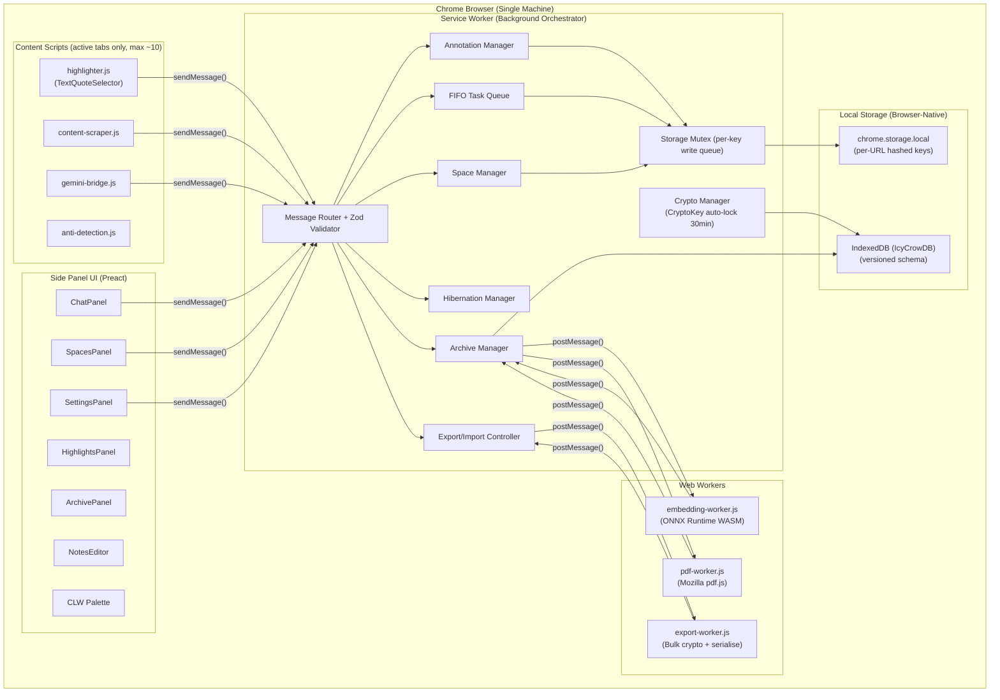
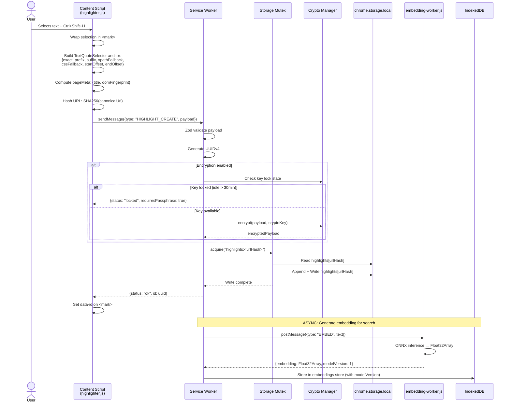
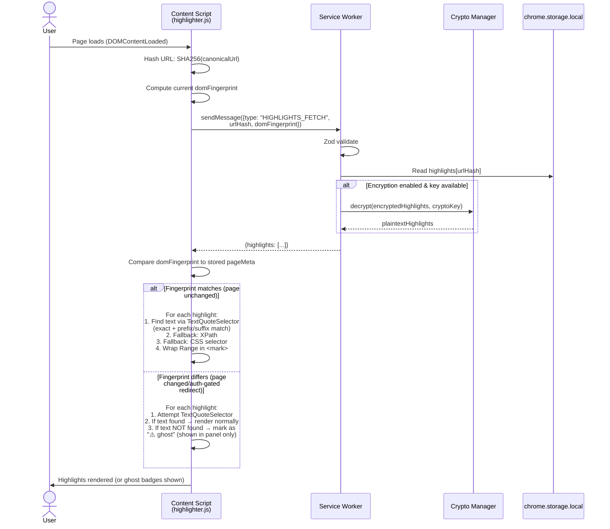
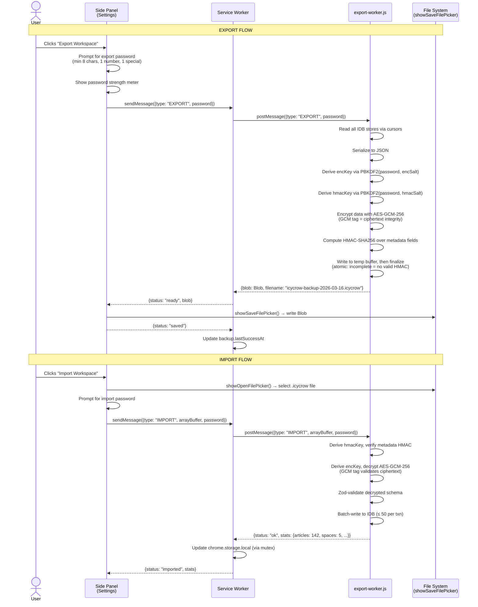

# IcyCrow — High-Level Architecture (HLA)

**Version:** 2.1 — Local-First Architecture (Audit Hardened)
**Date:** 2026-03-16
**Author:** AI-Generated (Principal Systems Architect)
**Status:** Draft v2.1 — Audit fixes applied for 22 findings
**Parent Document:** [PRD v3.1](./PRD.md)

---

## Table of Contents

1. [Technology Stack Selection & Justification](#1-technology-stack-selection--justification)
2. [System Architecture & Boundaries](#2-system-architecture--boundaries)
3. [System Diagrams](#3-system-diagrams)
4. [Data Flow Lifecycle](#4-data-flow-lifecycle)
5. [Data Persistence & Storage Strategy](#5-data-persistence--storage-strategy)
6. [Heavy Compute & Performance Architecture](#6-heavy-compute--performance-architecture)
7. [Portability, Sync & Backup](#7-portability-sync--backup)
8. [Security & Privacy Model](#8-security--privacy-model)

---

## 1. Technology Stack Selection & Justification

> [!IMPORTANT]
> There is **no remote backend, no cloud database, and no hosted authentication**. The entire technology stack runs inside the Chrome browser process.

### 1.1 Extension Runtime

| Layer | Technology | Version | Justification |
|---|---|---|---|
| **Extension Platform** | Chrome Extensions Manifest V3 | MV3 | Required for Chrome Web Store; service-worker model is resource-efficient and enforces strict security via CSP. |
| **UI Framework** | Preact | ≥ 10.x | React-compatible JSX at ~3 KB gzipped — keeps the Side Panel UI responsive while adding component ergonomics. |
| **Styling** | Vanilla CSS + CSS Custom Properties | — | Zero-dependency theming (light/dark mode); CSS custom properties enable runtime theme switching without a build step. |
| **Build Tool** | Vite | ≥ 5.x | Sub-second HMR; native ES module support; aggressive tree-shaking produces minimal bundles. Chrome extension output plugin (`crxjs/vite-plugin`) handles manifest generation. |
| **Markdown Rendering** | marked.js + highlight.js | ≥ 14.x / ≥ 11.x | Battle-tested, small, framework-agnostic. Renders AI chat responses and user notes with syntax-highlighted code blocks. |
| **Text Sanitisation** | DOMPurify | ≥ 3.x | Industry-standard XSS prevention; sanitises ALL rendered content (OWASP A7 mitigation). |
| **Fuzzy Search** | Fuse.js | ≥ 7.x | Lightweight (~5 KB) client-side fuzzy matching for the command palette. |
| **Message Validation** | Zod | ≥ 3.x | Runtime schema validation on all inter-component messages. Prevents service worker state poisoning from malformed content-script payloads. |

### 1.2 Local Data Layer

| Layer | Technology | Version | Justification |
|---|---|---|---|
| **Settings & Lightweight State** | `chrome.storage.local` | Browser-native | Fast key-value access for settings, Spaces, chat metadata. Supports `unlimitedStorage` permission for larger data sets. Per-key writes serialised via `storage-mutex.js` to prevent read-modify-write races. |
| **Structured Data (Articles, Embeddings, Annotations)** | IndexedDB (`IcyCrowDB`) | Browser-native | Structured, indexed storage for large records. Supports binary blobs (`Float32Array` for embeddings), compound indexes, and cursor-based iteration. Versioned schema with `onupgradeneeded` migration runner (`idb-migrations.js`). |
| **Encryption** | Web Crypto API (`SubtleCrypto`) | Browser-native | Hardware-accelerated AES-GCM-256 + PBKDF2 key derivation. Zero external dependencies. Keys generated as non-extractable `CryptoKey` objects. |

### 1.3 Heavy Compute Layer (Web Workers)

| Layer | Technology | Version | Justification |
|---|---|---|---|
| **Vector Embeddings** | ONNX Runtime Web (WASM-only) | ≥ 1.17 | Runs `all-MiniLM-L6-v2` inside a dedicated Web Worker. WASM-only build avoids CSP `eval()` violations. Produces 384-dimensional embeddings for semantic search. |
| **PDF Parsing** | pdf.js (Mozilla) | ≥ 4.x | Industry-standard PDF renderer used by Firefox. Worker-mode API extracts text page-by-page without blocking the main thread. |
| **Export/Import Processing** | Custom Web Worker (`export-worker.js`) | — | Handles serialisation, encryption, HMAC signing, and schema validation of `.icycrow` backup bundles off the main thread. **All bulk crypto runs here, never in the Service Worker** (prevents MV3 idle-termination from corrupting data). |

### 1.4 Development & Quality

| Layer | Technology | Version | Justification |
|---|---|---|---|
| **Testing** | Vitest + `jest-chrome` | ≥ 2.x | Vite-native test runner; fast parallel execution; `jest-chrome` provides Chrome API mocks. |
| **Linting** | ESLint + `eslint-plugin-jsdoc` | ≥ 9.x | Code quality enforcement and JSDoc coverage for public module APIs. |
| **CI/CD** | GitHub Actions | — | Automated lint → test → build pipeline on every push. No deployment step — there is no server to deploy to. |

---

## 2. System Architecture & Boundaries

### 2.1 The Two Core Domains

IcyCrow's local-first architecture has **two strictly separated domains**. There is no third domain — no remote backend exists.

```
┌────────────────────────────────────────────────────────────────────┐
│                         CHROME BROWSER                             │
│                                                                    │
│  ┌──────────────────────────────────────────────────────────────┐  │
│  │  DOMAIN 1: CONTENT SCRIPTS (DOM Layer — runs per tab)       │  │
│  │                                                              │  │
│  │  • highlighter.js — TextQuoteSelector anchoring + highlight  │  │
│  │  • content-scraper.js — Page text extraction                 │  │
│  │  • gemini-bridge.js — Types into Gemini, scrapes responses   │  │
│  │  • anti-detection.js — Human-mimicry typing/clicking         │  │
│  │                                                              │  │
│  │  RULES:                                                      │  │
│  │    ✗ NEVER accesses chrome.storage or IndexedDB              │  │
│  │    ✗ NEVER makes fetch() or network requests                 │  │
│  │    ✗ NEVER performs heavy computation                        │  │
│  │    ✗ Only injected into active/recently-active tabs (~10 max)│  │
│  │    ✓ Communicates ONLY via chrome.runtime.sendMessage()      │  │
│  │    ✓ Manipulates ONLY the host page DOM                      │  │
│  └───────────────────────────┬──────────────────────────────────┘  │
│                              │ chrome.runtime.sendMessage()        │
│                              ▼                                     │
│  ┌──────────────────────────────────────────────────────────────┐  │
│  │  DOMAIN 2: BACKGROUND ORCHESTRATOR (runs in Service Worker) │  │
│  │                                                              │  │
│  │  ┌───────────┐ ┌──────────┐ ┌──────────┐ ┌───────────────┐  │  │
│  │  │ AI Queue  │ │ Space    │ │ Hibernate│ │ Archive       │  │  │
│  │  │ Manager   │ │ Manager  │ │ Manager  │ │ Manager       │  │  │
│  │  └───────────┘ └──────────┘ └──────────┘ └───────────────┘  │  │
│  │  ┌───────────┐ ┌──────────┐ ┌──────────────────────────┐   │  │
│  │  │ Crypto    │ │ Export/  │ │ Message Router +         │   │  │
│  │  │ Manager   │ │ Import   │ │ Zod Validator + Mutex    │   │  │
│  │  └───────────┘ └──────────┘ └──────────────────────────┘   │  │
│  │                                                              │  │
│  │  RULES:                                                      │  │
│  │    ✓ SOLE owner of all persistent state                      │  │
│  │    ✓ SOLE component that reads/writes chrome.storage & IDB   │  │
│  │    ✓ Validates ALL inbound messages (Zod schema)             │  │
│  │    ✓ Serialises writes to same key via storage-mutex.js      │  │
│  │    ✓ Dispatches heavy compute to Web Workers                 │  │
│  │    ✗ NEVER touches the DOM                                   │  │
│  │    ✗ NEVER makes outbound network requests (except Ollama)   │  │
│  │    ✗ NEVER performs bulk encryption (delegates to Workers)   │  │
│  ├──────────────────────────────────────────────────────────────┤  │
│  │  STORAGE SUBSTRATES                                          │  │
│  │  ┌─────────────────┐    ┌────────────────────────────────┐  │  │
│  │  │ chrome.storage   │    │ IndexedDB (IcyCrowDB v1+)      │  │  │
│  │  │ .local           │    │ Versioned schema with           │  │  │
│  │  │ • settings       │    │ idb-migrations.js runner        │  │  │
│  │  │ • spaces         │    │ ┌──────────┐ ┌─────────────┐  │  │  │
│  │  │ • highlights:*   │    │ │ articles │ │ embeddings  │  │  │  │
│  │  │   (per-URL hash) │    │ ├──────────┤ ├─────────────┤  │  │  │
│  │  │ • chatHistories  │    │ │ annotate │ │ taskQueue   │  │  │  │
│  │  │ • queueState     │    │ ├──────────┤ ├─────────────┤  │  │  │
│  │  └─────────────────┘    │ │ backups  │ │ onnxModel   │  │  │  │
│  │                          │ └──────────┘ └─────────────┘  │  │  │
│  │                          └────────────────────────────────┘  │  │
│  └──────────────────────────────────────────────────────────────┘  │
│                              │ postMessage()                       │
│                              ▼                                     │
│  ┌──────────────────────────────────────────────────────────────┐  │
│  │  WEB WORKERS (CPU-Intensive Processing)                      │  │
│  │                                                              │  │
│  │  • embedding-worker.js — ONNX Runtime (vector generation +   │  │
│  │                          cosine similarity search)            │  │
│  │  • export-worker.js   — Serialise, encrypt, sign backups     │  │
│  │                         (ALL bulk crypto runs here)           │  │
│  │  • pdf-worker.js      — pdf.js text extraction               │  │
│  └──────────────────────────────────────────────────────────────┘  │
│                                                                    │
│  ┌──────────────────────────────────────────────────────────────┐  │
│  │  SIDE PANEL UI (Preact)                                      │  │
│  │  Chat | Spaces | Highlights | Archive | Notes | Settings     │  │
│  │                                                              │  │
│  │  RULES:                                                      │  │
│  │    ✓ Pure presentation layer — renders state from SW          │  │
│  │    ✓ Sends user actions to SW via chrome.runtime.sendMessage  │  │
│  │    ✓ MAY invoke File Picker APIs (user-gesture-driven I/O)   │  │
│  │    ✗ NEVER reads chrome.storage or IndexedDB directly        │  │
│  │    ✗ NEVER runs heavy compute (> 16ms frame budget)          │  │
│  └──────────────────────────────────────────────────────────────┘  │
│                                                                    │
│  ┌──────────────────────────────────────────────────────────────┐  │
│  │  OPTIONAL: localhost:11434 (Ollama for offline AI)            │  │
│  └──────────────────────────────────────────────────────────────┘  │
└────────────────────────────────────────────────────────────────────┘
```

### 2.2 Boundary Rules (Inviolable)

> [!CAUTION]
> These rules are **non-negotiable**. Any AI coding agent that violates these boundaries must be corrected immediately.

| Rule | Constraint | Rationale |
|---|---|---|
| **B-1** | Content Scripts **MUST NOT** access `chrome.storage` or IndexedDB. | Centralising storage in the Service Worker prevents race conditions and ensures a single source of truth. |
| **B-2** | Content Scripts **MUST NOT** make `fetch()` calls. | There is no remote server. The only "network" interaction is DOM automation of the Gemini tab, which is handled via content-script DOM manipulation, not HTTP. |
| **B-3** | The Side Panel UI **MUST NOT** read/write `chrome.storage` or IndexedDB directly. | It receives state updates via `chrome.runtime.onMessage` and sends actions via `chrome.runtime.sendMessage`. **Exception:** File Picker APIs (`showOpenFilePicker`, `showSaveFilePicker`) are permitted because they require a DOM-attached context for the browser dialog and are user-gesture-gated. |
| **B-4** | The Service Worker **MUST** validate every inbound message against Zod schemas. | Unknown types are dropped. This prevents state poisoning from compromised content scripts. |
| **B-5** | Heavy compute **MUST** run in Web Workers only. | The Side Panel must never block > 16ms (60fps frame budget). CPU-intensive tasks (embeddings, export, PDF parsing, bulk encryption) are dispatched to dedicated Web Workers. |
| **B-6** | The Service Worker **MUST NOT** make outbound network requests. | Exception: `fetch('http://localhost:11434/...')` for optional Ollama integration. No telemetry, no analytics, no CDN calls. |
| **B-7** | The Service Worker **MUST NOT** perform bulk encryption. | All batch crypto (export, import, re-encryption) is delegated to `export-worker.js`. The SW only performs single-record `SubtleCrypto` calls (atomic, < 50ms, survives MV3 idle termination). |
| **B-8** | All writes to the same `chrome.storage.local` key **MUST** be serialised. | `storage-mutex.js` provides a per-key `Promise` chain. Concurrent writes queue rather than race (prevents read-modify-write corruption). |

### 2.3 Domain Responsibility Matrix

| Responsibility | Content Script | Service Worker | Web Workers | Side Panel UI |
|---|---|---|---|---|
| DOM manipulation (highlights, notes) | ✅ Primary | ❌ | ❌ | ❌ |
| User gesture capture (selection, hotkeys) | ✅ Primary | ❌ | ❌ | ❌ |
| Gemini DOM automation | ✅ Primary | ✅ Orchestrates | ❌ | ❌ |
| Message routing & validation | ❌ | ✅ Primary | ❌ | ❌ |
| State management (all CRUD) | ❌ | ✅ Primary | ❌ | ❌ |
| Storage I/O (chrome.storage + IDB) | ❌ | ✅ Primary | ✅ Read-only (IDB cursors) | ❌ |
| Single-record encryption/decryption | ❌ | ✅ Primary | ❌ | ❌ |
| Bulk encryption (export/import) | ❌ | ❌ Dispatches | ✅ Primary | ❌ |
| Vector embedding generation | ❌ | ❌ Dispatches | ✅ Primary | ❌ |
| Semantic search (cosine similarity) | ❌ | ❌ Dispatches | ✅ Primary | ❌ |
| PDF text extraction | ❌ | ❌ Dispatches | ✅ Primary | ❌ |
| Export/import processing | ❌ | ✅ Initiates | ✅ Primary | ❌ |
| File picker dialogs | ❌ | ❌ | ❌ | ✅ Primary |
| UI rendering | ❌ | ❌ | ❌ | ✅ Primary |
| Tab lifecycle (spaces, hibernation) | ❌ | ✅ Primary | ❌ | ❌ |

---

## 3. System Diagrams

### 3.1 Component Interaction — Full Local-First System



### 3.2 Sequence — Create & Save a Highlight (Audit-Hardened)



### 3.3 Sequence — Load Page & Restore Highlights (Anchor-Resilient)



---

## 4. Data Flow Lifecycle

### 4.1 Lifecycle A — Create & Persist an Annotation

**Pattern: Mutex-Protected Local Write (instant feedback, race-safe)**

```
STEP 1 — CAPTURE (Content Script)
│
│  User selects text → Ctrl+Shift+H (or context menu)
│  highlighter.js:
│    • Gets Range via window.getSelection()
│    • Wraps in <mark class="icycrow-highlight" data-id="pending">
│    • Builds W3C TextQuoteSelector anchor:
│        ─ exact: the selected text verbatim
│        ─ prefix: 50 chars before selection
│        ─ suffix: 50 chars after selection
│        ─ xpathFallback: XPath to container (optional, best-effort)
│        ─ cssFallback: CSS selector (optional, best-effort)
│        ─ startOffset, endOffset
│    • Computes pageMeta: { title, domFingerprint }
│    • Hashes URL: SHA256(canonicalUrl) via url-utils.js
│    • Builds: { text, anchor, url, urlHash, pageMeta, timestamp }
│
├─── chrome.runtime.sendMessage({type: "HIGHLIGHT_CREATE"}) ───►
│
STEP 2 — VALIDATE & PERSIST (Service Worker)
│
│  Service Worker:
│    • Zod-validates the inbound message
│    • Generates UUIDv4
│    • If encryption enabled: encrypt with CryptoKey (single-record, atomic)
│    • Acquires per-key mutex via storage-mutex.js
│    • Reads chrome.storage.local key `highlights:<urlHash>`
│    • Appends new highlight
│    • Writes back (mutex-protected, no race condition)
│    • Returns { status: "ok", id } to Content Script
│    • Dispatches embedding generation to Web Worker (async)
│
├─── Instant {ok, id} response ───►
│
STEP 3 — UPDATE DOM (Content Script)
│
│  Content Script:
│    • Updates <mark data-id="pending"> → <mark data-id="<uuid>">
│    • User sees immediate visual confirmation
│
STEP 4 — ASYNC EMBEDDING (Web Worker — non-blocking)
│
│  embedding-worker.js:
│    • Receives text via postMessage()
│    • ONNX Runtime generates 384-dim Float32Array
│    • Returns { embedding, modelVersion } to Service Worker
│    • Service Worker writes to IndexedDB (with modelVersion tag)
```

### 4.2 Lifecycle B — Load Page & Restore Annotations

**Pattern: Cache-First Instant Render with Auth-Gate Detection**

```
STEP 1 — PAGE LOAD (Content Script)
│
│  DOMContentLoaded fires.
│  highlighter.js:
│    • Hashes canonical URL: SHA256(url)
│    • Computes domFingerprint: SHA256(body.innerText.slice(0, 500))
│    • Sends: sendMessage({type: "HIGHLIGHTS_FETCH", urlHash, domFingerprint})
│
STEP 2 — CACHE READ (Service Worker)
│
│  Service Worker:
│    • Reads chrome.storage.local key `highlights:<urlHash>`
│    • If encrypted & key locked → returns { status: "locked" }
│    • If encrypted & key available → decrypt
│    • Returns highlights array + stored pageMeta
│
STEP 3 — RENDER WITH ANCHOR RESILIENCE (Content Script)
│
│  Content Script compares current domFingerprint to stored pageMeta:
│
│  IF fingerprint MATCHES (page is the same):
│    For each highlight:
│      1. Find text via TextQuoteSelector (exact + prefix/suffix)
│      2. Fallback: XPath
│      3. Fallback: CSS selector
│      4. Wrap Range in <mark data-id="<uuid>">
│
│  IF fingerprint DIFFERS (page changed / auth-gated redirect):
│    For each highlight:
│      1. Attempt TextQuoteSelector match anyway
│      2. If text found → render normally
│      3. If text NOT found → mark as "ghost highlight"
│         ─ Not rendered on page (DOM is different)
│         ─ Shown in HighlightsPanel with ⚠️ badge:
│           "Could not locate on page — DOM has changed"
│         ─ User can manually delete or keep for later
│
│  Highlights visible within ~50ms of DOMContentLoaded.
│  No network requests. Pure local read.
```

### 4.3 Lifecycle C — Semantic Search (with Model Versioning)

```
STEP 1 — QUERY (Side Panel UI)
│
│  User types "gradient descent convergence" in Archive search bar.
│  UI sends: sendMessage({type: "SEMANTIC_SEARCH", query: "..."})
│
STEP 2 — DISPATCH (Service Worker)
│
│  Service Worker:
│    • Checks current model version against settings.archive.embeddingModelVersion
│    • Forwards to embedding-worker.js:
│      postMessage({type: "SEARCH", query, topK: 10, currentModelVersion: 1})
│
STEP 3 — COMPUTE (Web Worker)
│
│  embedding-worker.js:
│    • Generates query embedding via ONNX (using currentModelVersion model)
│    • Opens IndexedDB cursor on embeddings store
│    • SKIPS embeddings where modelVersion !== currentModelVersion
│    • Computes cosine similarity for matching embeddings
│    • Returns top-K article IDs sorted by relevance
│    • Returns count of stale embeddings (wrong version)
│
STEP 4 — RESOLVE (Service Worker)
│
│  Service Worker:
│    • Fetches article metadata from IndexedDB articles store
│    • Decrypts if needed
│    • If stale embedding count > 0: queue background re-embedding job
│    • Returns enriched results + stale warning to Side Panel
│
STEP 5 — RENDER (Side Panel UI)
│
│  ArchivePanel renders results with title, URL, snippet, score.
│  If stale embeddings exist: shows banner "Updating search index... (N articles)"
│  Total flow: < 500ms for 10,000 stored articles.
```

---

## 5. Data Persistence & Storage Strategy

### 5.1 Storage Tier Architecture

| Tier | Engine | Use Case | Max Capacity | Access Pattern |
|---|---|---|---|---|
| **Tier 1: Hot State** | `chrome.storage.local` | Settings, Spaces, highlights metadata (per-URL hashed keys), chat histories (per-Space keys), queue state | `unlimitedStorage` (effectively disk-bound) | Frequent read/write. < 1ms reads. **Per-key mutex** prevents races. |
| **Tier 2: Structured Data** | IndexedDB (`IcyCrowDB`) | Full-text articles, vector embeddings (Float32Array), annotations, ONNX model cache, backup manifest | Browser-managed quota (GB-scale) | Infrequent writes, frequent reads via cursors. **Versioned schema** with migration runner. |
| **Tier 3: Export Artifacts** | File System Access API | `.icycrow` backup files, `.md` note exports | User's filesystem | On-demand write (export), on-demand read (import). Fallback: `chrome.downloads.download()`. |

### 5.2 IndexedDB Schema — `IcyCrowDB` (Versioned)

> [!NOTE]
> **Migration Strategy:** The DB starts at version 1. Every schema change bumps the version. `idb-migrations.js` runs sequential migration functions in `onupgradeneeded`. All migration functions are preserved indefinitely so a user upgrading from v1 → v5 runs: v1→v2, v2→v3, v3→v4, v4→v5 in order.

| Object Store | Key Path | Indexes | Record Fields |
|---|---|---|---|
| `articles` | `id` | `url`, `savedAt`, `spaceId` | `{ id, url, title, fullText, aiSummary, userNotes, savedAt, spaceId, encrypted: bool }` |
| `embeddings` | `articleId` | `modelVersion` | `{ articleId, vector: Float32Array, modelVersion: int, createdAt }` |
| `annotations` | `id` | `url` | `{ id, url, type: "drawing"\|"comment"\|"shape", data: {...}, createdAt }` |
| `taskQueue` | `id` | `status`, `createdAt` | `{ id, prompt, contextTabs, status, result, createdAt }` |
| `onnxModelCache` | `modelName` | — | `{ modelName, modelData: ArrayBuffer, version: int, cachedAt }` |
| `backupManifest` | `id` | `createdAt` | `{ id, timestamp, fileSize, checksum, location }` |

### 5.3 `chrome.storage.local` Key Design

| Key Pattern | Example | Content | Rationale |
|---|---|---|---|
| `settings` | `settings` | All user preferences (single object) | Rarely written. |
| `spaces` | `spaces` | All Space definitions | Moderate write frequency. |
| `highlights:<SHA256>` | `highlights:a1b2c3d4...` | Highlights for a specific URL | **Per-URL key** avoids loading all highlights into memory. SHA256 hash prevents key collisions from URLs containing special characters. |
| `chatHistories:<spaceId>` | `chatHistories:uuid-here` | Chat history for one Space | **Per-Space key** prevents loading all chats on panel open. |
| `queueState` | `queueState` | FIFO queue persistence | Written on every queue state change for crash recovery. |

### 5.4 Data Durability Guarantees

| Scenario | Risk | Mitigation |
|---|---|---|
| **Browser crash** | In-flight IndexedDB transaction may be lost. | All critical writes use short, atomic transactions (≤ 50 records). Queue state is persisted on every status change. |
| **Extension update** | `chrome.storage.local` and IndexedDB both survive updates. Schema may need migration. | Auto-backup via `chrome.runtime.onUpdateAvailable`. `idb-migrations.js` handles schema upgrades seamlessly. |
| **Chrome profile deletion** | All extension data is deleted. | Scheduled backup feature (§7) writes `.icycrow` files to the filesystem, which survives profile deletion. |
| **Disk space exhaustion** | IndexedDB writes fail with `QuotaExceededError`. | Storage dashboard in Settings tracks usage. Warning at 80% of soft cap. Oldest articles can be archived/exported and purged. |
| **ONNX model update** | New model produces incompatible embeddings. | `modelVersion` stored per-embedding. On version mismatch, background re-embedding job queued with progress banner. |

---

## 6. Heavy Compute & Performance Architecture

### 6.1 Worker Pool Design

```
Service Worker (orchestrator)
│
├─── embedding-worker.js  (warm while SW alive)
│     • Loads ONNX model ONCE on first use
│     • Keeps model in WASM memory between calls
│     • Handles: embed(), search(), batchEmbed()
│     • On SW termination: worker dies. On SW restart: re-created,
│       model re-loaded from IDB cache (~200ms warm start)
│
├─── export-worker.js  (on-demand, cold-start)
│     • Spawned only when user triggers export/import
│     • Handles ALL bulk crypto: serialize(), encrypt(), decrypt(),
│       sign(), verify()  ← NEVER done in SW
│     • Terminated after operation completes
│
└─── pdf-worker.js  (on-demand, cold-start)
      • Spawned when user saves a PDF-based article
      • Handles: extractText(pdfArrayBuffer)
      • Terminated after extraction completes
```

> [!NOTE]
> **MV3 Worker Lifecycle (G-2):** When the Service Worker terminates (idle 30s), its Web Worker references are lost. On restart, `service-worker.js` checks `queueState` for any in-flight embedding tasks and re-dispatches them to a fresh `embedding-worker.js`. The ONNX model is loaded from the `onnxModelCache` IDB store (~200ms), not re-downloaded. **Alternative for long-running tasks:** Consider using `chrome.offscreen.createDocument()` (MV3) to host Web Workers that survive Service Worker termination.

### 6.2 Performance Budget

| Operation | Max Duration | Worker | Notes |
|---|---|---|---|
| Single article embedding | < 2 seconds | `embedding-worker.js` | First call includes ~500ms model load (warm start after). |
| Batch embedding (10 articles) | < 15 seconds | `embedding-worker.js` | Sequential processing with progress reporting via `postMessage`. |
| Semantic search (10k articles) | < 500 ms | `embedding-worker.js` | Brute-force cosine similarity. Post-MVP: HNSW ANN index. |
| Full workspace export (1000 articles) | < 10 seconds | `export-worker.js` | Streaming JSON serialisation + AES-GCM encryption. |
| Full workspace import | < 15 seconds | `export-worker.js` | HMAC verify + decrypt + Zod validate + batched IDB writes. |
| PDF text extraction (100-page doc) | < 5 seconds | `pdf-worker.js` | Page-by-page extraction with progress callback. |
| UI frame render | < 16 ms (60fps) | Main thread | **Absolute invariant.** No heavy compute ever touches the Side Panel main thread. |

### 6.3 ONNX Model Loading Strategy

```
Extension Install
    │
    ├─ Model WASM binary IS bundled (in /models/ directory)
    │  but NOT loaded into memory until first use
    │
    ▼
First Semantic Search Query
    │
    ├─ Check IndexedDB onnxModelCache store
    │
    ├─ Cache MISS ──► Load from bundled extension assets
    │                  ├─ Show progress: "Loading search model... (one-time)"
    │                  ├─ Load into ONNX Runtime session
    │                  └─ Cache ArrayBuffer in IndexedDB for fast reload
    │
    └─ Cache HIT ───► Load from IndexedDB into ONNX Runtime
                       └─ Warm start: ~200ms

Extension Update (model version bumped)
    │
    ├─ Compare bundled model version vs cached version
    │
    ├─ Mismatch ──► Replace cache with new model
    │               ├─ Queue background re-embedding for all articles
    │               └─ Show banner: "Updating search index..."
    │
    └─ Match ──► No action needed
```

---

## 7. Portability, Sync & Backup

### 7.1 The `.icycrow` Bundle Format

All data portability is handled via a **single encrypted file format**.

```json
{
  "format": "icycrow-bundle",
  "version": "1.0",
  "exportedAt": "ISO-8601",
  "extensionVersion": "0.1.0",
  "metadataHmac": "HMAC-SHA256 over {format, version, exportedAt, extensionVersion}",
  "encrypted": true,
  "encSalt": "base64 (PBKDF2 salt for AES-GCM key)",
  "hmacSalt": "base64 (PBKDF2 salt for HMAC key — SEPARATE from encSalt)",
  "iv": "base64 (AES-GCM initialisation vector)",
  "data": "base64-encoded AES-GCM-256 ciphertext (GCM tag provides integrity)"
}
```

> [!IMPORTANT]
> **Key Separation (V-2 fix):** Two different PBKDF2 salts derive two independent keys from the same password: one for AES-GCM-256 encryption (ciphertext integrity via GCM auth tag), one for HMAC-SHA256 over the *unencrypted* metadata fields. This follows NIST SP 800-108 key-separation guidance.

**Decrypted `data` payload:**

```json
{
  "spaces": { ... },
  "chatHistories": { ... },
  "highlights": { ... },
  "settings": { ... },
  "articles": [ ... ],
  "embeddings": [ { "articleId": "...", "vector": [0.12, -0.34, ...], "modelVersion": 1 } ],
  "annotations": [ ... ]
}
```

### 7.2 Export/Import Flow



### 7.3 Scheduled Auto-Backup

| Setting | Default | Description |
|---|---|---|
| `backup.enabled` | `true` | Master toggle for auto-backup. |
| `backup.intervalDays` | `7` | Days between automatic backups. |
| `backup.maxBackups` | `5` | Retain last N backups. Oldest is deleted when limit is exceeded. |
| `backup.directoryHandle` | `null` | Persistent `FileSystemDirectoryHandle` obtained via `showDirectoryPicker()` on first setup. |
| `backup.password` | *(user-set)* | Encryption password for backup files. |
| `backup.lastSuccessAt` | `null` | ISO-8601 timestamp of last successful backup. |

> [!WARNING]
> **File System Access API Permission Loss (G-5 fix):** The persisted `FileSystemDirectoryHandle` can be revoked by Chrome after a browser restart or permissions reset. The Service Worker checks handle validity on each backup attempt. On failure:
> 1. Fallback to `chrome.downloads.download()` (writes to default Downloads folder, no user gesture required).
> 2. Show `chrome.notifications` alert: "Auto-backup directory access lost. Click to re-authorise."
> 3. If `backup.lastSuccessAt` is > 2× `backup.intervalDays` ago, show a persistent warning banner in the Side Panel.

---

## 8. Security & Privacy Model

### 8.1 Fundamental Security Posture

```
┌──────────────────────────────────────────────────────────┐
│                    TRUST BOUNDARY                         │
│                                                          │
│  ┌─────────────────────────┐                             │
│  │  TRUSTED ZONE           │  chrome.storage.local       │
│  │  ─────────────────      │  IndexedDB (IcyCrowDB)      │
│  │  Service Worker         │  Web Workers                │
│  │  Side Panel UI          │  Export files (encrypted)    │
│  └─────────────────────────┘                             │
│                                                          │
│  ┌─────────────────────────┐                             │
│  │  UNTRUSTED ZONE         │                             │
│  │  ─────────────────      │                             │
│  │  Host page DOM          │  ← Content scripts run in   │
│  │  Gemini web UI DOM      │    isolated world but        │
│  │  User-pasted content    │    interact with untrusted   │
│  │  Imported .icycrow files│    DOM elements              │
│  └─────────────────────────┘                             │
└──────────────────────────────────────────────────────────┘
```

### 8.2 Security Controls

| # | Control | Implementation |
|---|---|---|
| **SC-1** | **At-Rest Encryption (Opt-In)** | AES-GCM-256 via `SubtleCrypto`. Key derived from passphrase via PBKDF2 (100,000 iterations, SHA-256). Keys are created as **non-extractable** (`extractable: false`). Opt-in: plaintext by default, encrypted when passphrase is set. |
| **SC-2** | **Key Auto-Lock** | `CryptoKey` held only in Service Worker closure scope. Auto-wiped after 30 min idle (configurable). User must re-enter passphrase after lock. Limits exposure window for physical access attacks. |
| **SC-3** | **Export Integrity (Dual-Key)** | `.icycrow` files use AES-GCM-256 (GCM auth tag for ciphertext integrity) + HMAC-SHA256 (separate PBKDF2 salt) for metadata integrity. Two independent keys from one password. |
| **SC-4** | **Passphrase Strength** | Export passwords: enforced minimum (8 chars, 1 number, 1 special). At-rest passwords: strength meter with warning, no hard block. |
| **SC-5** | **Content Sanitisation** | DOMPurify sanitises ALL content before DOM injection: scraped page text, Gemini responses, highlight text, user notes, and imported data. |
| **SC-6** | **Message Validation** | Every `chrome.runtime.sendMessage()` payload validated against Zod schemas in `zod-schemas.js`. Malformed messages dropped and logged to diagnostics. |
| **SC-7** | **Write Race Prevention** | `storage-mutex.js` serialises all writes to the same `chrome.storage.local` key via per-key `Promise` chains. |
| **SC-8** | **CSP Enforcement** | `script-src 'self'; object-src 'none'; connect-src 'self' http://localhost:11434`. No remote scripts, no eval, no inline handlers. |
| **SC-9** | **Minimal Permissions** | `tabs`, `storage`, `unlimitedStorage`, `sidePanel`, `activeTab`, `scripting`, `idle`. No `<all_urls>`. Optional host permissions per-site. |
| **SC-10** | **Isolated World Execution** | Content scripts run in Chrome's isolated world — separate JS context from the host page. Host page cannot read or modify content script variables. |
| **SC-11** | **No Outbound Network** | Zero outbound HTTP requests. CSP `connect-src` locked to `'self'` + `localhost:11434`. |
| **SC-12** | **CryptoKey Non-Extractable** | `deriveKey()` called with `extractable: false`. The key object cannot be serialised, exported, or sent via `postMessage()`. No message handler ever returns key material. |

### 8.3 What We Don't Need (Removed from HLA v1.0)

| Removed Concern | Why It No Longer Applies |
|---|---|
| **JWT Authentication** | No server = no bearer tokens. Chrome profile IS the identity boundary. |
| **CORS Policy** | No cross-origin requests are made. There is no API server to configure CORS on. |
| **SQL Injection Prevention** | No SQL database. IndexedDB uses structured key-value access (no query language). |
| **Server-Side Rate Limiting** | No server. The only rate limiting is on Gemini Bridge interactions (anti-detection engine). |
| **HTTPS/TLS Configuration** | No server endpoints to secure. Ollama runs on `localhost` (plaintext is acceptable for loopback). |
| **Refresh Token Rotation** | No tokens of any kind. |
| **Password Hashing (bcrypt)** | No user accounts. The encryption passphrase is used directly for key derivation (PBKDF2), never stored. |

---

> **End of HLA v2.1 — Local-First Architecture (Audit Hardened)** — This document defines the architectural blueprint for IcyCrow. There are **zero cloud dependencies**. All 22 audit findings have been addressed. AI coding agents should use this alongside the [PRD v3.1](./PRD.md) for requirements and implementation order.
