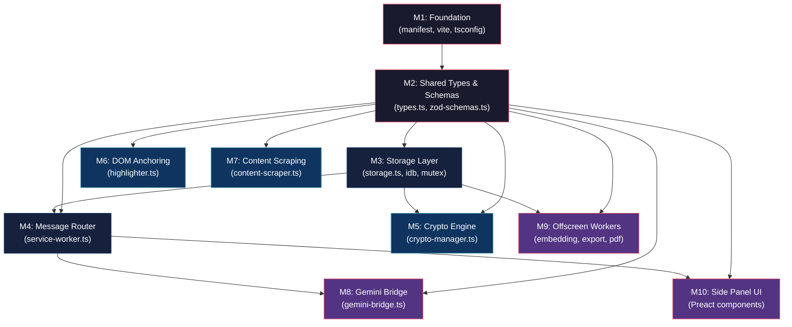

# IcyCrow — Execution Plan & System Decomposition

**Version:** 1.0
**Date:** 2026-03-16
**Author:** AI-Generated (Lead Technical Project Manager & MV3 Expert)
**Status:** Master Build Roadmap for AI-Assisted Vibe Coding
**Parent Documents:** [PRD v3.1](./PRD.md) · [HLA v2.1](./HLA.md) · [LLD v1.0](./LLD.md)

---

## 1. System Decomposition — Self-Contained Modules

### 1.1 Module Map

IcyCrow decomposes into **10 isolated modules**. Each module has a single owner (one primary file), strict inputs/outputs, and can be unit-tested in isolation.

| # | Module | Primary File(s) | Responsibility | Dependencies |
|---|---|---|---|---|
| **M1** | **Foundation** | `manifest.json`, `vite.config.ts`, `tsconfig.json` | Build system, extension config, dev environment | None (root) |
| **M2** | **Shared Types & Schemas** | `lib/types.ts`, `lib/zod-schemas.ts` | All TypeScript interfaces, Zod validators, branded types | M1 |
| **M3** | **Storage Layer** | `lib/storage.ts`, `lib/storage-mutex.ts`, `lib/idb-migrations.ts`, `lib/url-utils.ts` | `chrome.storage.local` abstraction, IndexedDB via `idb`, per-key mutex, URL hashing | M2 |
| **M4** | **Message Router** | `background/service-worker.ts` (router only) | Zod-validated message dispatch, boot sequence, alarms | M2, M3 |
| **M5** | **Crypto Engine** | `background/crypto-manager.ts`, `lib/crypto-utils.ts` | PBKDF2 key derivation, AES-GCM encrypt/decrypt, auto-lock | M2, M3 |
| **M6** | **DOM Anchoring & Highlighting** | `content-scripts/highlighter.ts` | TextQuoteSelector capture, 4-strategy restore, `<mark>` rendering | M2 |
| **M7** | **Content Scraping** | `content-scripts/content-scraper.ts` | Extract page text, chunk large payloads, canonical URL | ✅ |
| **M8** | **Gemini Bridge** | `content-scripts/gemini-bridge.ts`, `content-scripts/anti-detection.ts`, `lib/gemini-selectors.ts` | DOM automation of Gemini tab, human-mimicry typing, selector health | ✅ |
| **M9** | **Offscreen Workers** | `offscreen/offscreen.ts`, `workers/embedding-worker.ts`, `workers/export-worker.ts`, `workers/pdf-worker.ts` | ONNX embedding, cosine search, export/import crypto, PDF parsing | ✅ |
| **M10** | **Side Panel UI** | `side-panel/**` (Preact components, hooks, CSS) | Chat, Spaces, Highlights, Archive, Notes, Settings, CLW | M2 |

### 1.2 Module Dependency Graph



### 1.3 Build Order (Strict Bottom-Up)

```
Layer 0 (Foundation):  M1
Layer 1 (Contracts):   M2
Layer 2 (Data):        M3, M5
Layer 3 (Orchestrator):M4
Layer 4 (Features):    M6, M7, M8, M9
Layer 5 (UI):          M10
```

> [!CAUTION]
> **Rule:** No module in Layer N may be built before ALL modules in Layer N-1 are complete and passing tests. This prevents integration failures.

---

## 2. Project Skeleton & Directory Structure

### 2.1 Configuration Files

#### `manifest.json`

```jsonc
{
  "manifest_version": 3,
  "name": "IcyCrow",
  "version": "0.1.0",
  "description": "Zero-cost AI agent & web annotator. 100% local-first.",
  "permissions": [
    "tabs",
    "storage",
    "unlimitedStorage",
    "sidePanel",
    "activeTab",
    "scripting",
    "idle",
    "alarms",
    "offscreen"
  ],
  "optional_host_permissions": ["<all_urls>"],
  "background": {
    "service_worker": "src/background/service-worker.ts",
    "type": "module"
  },
  "side_panel": {
    "default_path": "src/side-panel/index.html"
  },
  "content_scripts": [
    {
      "matches": ["<all_urls>"],
      "js": ["src/content-scripts/highlighter.ts", "src/content-scripts/content-scraper.ts"],
      "css": ["src/content-scripts/highlight.css"],
      "run_at": "document_idle"
    }
  ],
  "content_security_policy": {
    "extension_pages": "script-src 'self' 'wasm-unsafe-eval'; object-src 'none'; connect-src 'self' http://localhost:11434"
  },
  "icons": {
    "16": "src/assets/icons/icon-16.png",
    "48": "src/assets/icons/icon-48.png",
    "128": "src/assets/icons/icon-128.png"
  }
}
```

#### `vite.config.ts`

```typescript
import { defineConfig } from 'vite';
import preact from '@preact/preset-vite';
import { crx } from '@crxjs/vite-plugin';
import manifest from './manifest.json';

export default defineConfig({
  plugins: [
    preact(),
    crx({ manifest }),
  ],
  build: {
    target: 'esnext',
    minify: 'terser',
    rollupOptions: {
      input: {
        'side-panel': 'src/side-panel/index.html',
        offscreen: 'src/offscreen/offscreen.html',
      },
    },
  },
  worker: {
    format: 'es',
  },
});
```

#### `tsconfig.json`

```jsonc
{
  "compilerOptions": {
    "target": "ESNext",
    "module": "ESNext",
    "moduleResolution": "bundler",
    "jsx": "react-jsx",
    "jsxImportSource": "preact",
    "strict": true,
    "noUnusedLocals": true,
    "noUnusedParameters": true,
    "forceConsistentCasingInFileNames": true,
    "resolveJsonModule": true,
    "isolatedModules": true,
    "esModuleInterop": true,
    "skipLibCheck": true,
    "types": ["chrome", "vite/client"],
    "baseUrl": ".",
    "paths": {
      "@lib/*": ["src/lib/*"],
      "@bg/*": ["src/background/*"],
      "@ui/*": ["src/side-panel/*"],
      "@workers/*": ["src/workers/*"]
    }
  },
  "include": ["src/**/*.ts", "src/**/*.tsx"],
  "exclude": ["node_modules", "dist"]
}
```

### 2.2 Full Directory Structure

```
icycrow/
├── manifest.json                          # MV3 manifest (see §2.1)
├── vite.config.ts                         # Vite + CRXJS plugin (see §2.1)
├── tsconfig.json                          # Strict TypeScript config (see §2.1)
├── package.json
├── .eslintrc.cjs
├── .gitignore
│
├── src/
│   │
│   ├── background/                        # ── SERVICE WORKER (Domain 2) ──
│   │   ├── service-worker.ts              # Entry: boot, message router, alarms
│   │   ├── managers/
│   │   │   ├── task-queue.ts              # FIFO queue engine + circuit breaker
│   │   │   ├── gemini-detector.ts         # Tab detection via URL pattern
│   │   │   ├── space-manager.ts           # Space CRUD, Live Sync, tab groups
│   │   │   ├── hibernation-manager.ts     # Tab discard on idle
│   │   │   ├── article-saver.ts           # Save page → IDB + queue embedding
│   │   │   ├── crypto-manager.ts          # Key lifecycle, auto-lock, en/decrypt
│   │   │   └── export-controller.ts       # Orchestrate export/import via offscreen
│   │   └── offscreen-manager.ts           # Create/reuse chrome.offscreen document
│   │
│   ├── content-scripts/                   # ── DOMAIN 1 (per-tab) ──
│   │   ├── highlighter.ts                 # Capture + restore + <mark> rendering
│   │   ├── highlight.css                  # Highlight colours + sticky-note styles
│   │   ├── content-scraper.ts             # Page text extraction + chunking
│   │   ├── gemini-bridge.ts               # Type prompts, scrape responses
│   │   └── anti-detection.ts              # Human-mimicry timing engine
│   │
│   ├── side-panel/                        # ── UI LAYER (Preact) ──
│   │   ├── index.html                     # Side Panel HTML entry
│   │   ├── index.tsx                      # Preact root + router
│   │   ├── index.css                      # Design tokens + CSS custom properties
│   │   ├── components/
│   │   │   ├── ChatPanel.tsx
│   │   │   ├── SpacesPanel.tsx
│   │   │   ├── HighlightsPanel.tsx
│   │   │   ├── ArchivePanel.tsx
│   │   │   ├── NotesEditor.tsx
│   │   │   ├── SettingsPanel.tsx
│   │   │   └── CLW.tsx                    # Ctrl+K command palette
│   │   └── hooks/
│   │       ├── useStorage.ts              # Reactive chrome.storage hook
│   │       └── useQueue.ts                # Task queue status hook
│   │
│   ├── offscreen/                         # ── OFFSCREEN DOCUMENT ──
│   │   ├── offscreen.html                 # Hidden page hosting Web Workers
│   │   └── offscreen.ts                   # Message relay to/from workers
│   │
│   ├── workers/                           # ── WEB WORKERS (CPU-intensive) ──
│   │   ├── embedding-worker.ts            # ONNX Runtime (embed + cosine search)
│   │   ├── export-worker.ts               # Serialise + AES-GCM + HMAC
│   │   └── pdf-worker.ts                  # pdf.js text extraction
│   │
│   ├── lib/                               # ── SHARED LIBRARIES ──
│   │   ├── types.ts                       # All TypeScript interfaces + branded types
│   │   ├── zod-schemas.ts                 # Message Zod validators (discriminated union)
│   │   ├── storage.ts                     # chrome.storage + IDB abstraction
│   │   ├── storage-mutex.ts               # Per-key write queue
│   │   ├── idb-migrations.ts              # Sequential IDB schema upgrades
│   │   ├── crypto-utils.ts                # AES-GCM + PBKDF2 wrappers
│   │   ├── url-utils.ts                   # Canonical URL + SHA-256 hashing
│   │   ├── context-builder.ts             # Multi-tab context assembly + token budget
│   │   ├── gemini-selectors.ts            # Centralised selector candidates
│   │   ├── diagnostics.ts                 # Debug log collector for export
│   │   └── constants.ts                   # App-wide constants (defaults, limits)
│   │
│   └── assets/
│       └── icons/
│           ├── icon-16.png
│           ├── icon-48.png
│           └── icon-128.png
│
├── tests/
│   ├── lib/
│   │   ├── storage.test.ts
│   │   ├── storage-mutex.test.ts
│   │   ├── idb-migrations.test.ts
│   │   ├── crypto-utils.test.ts
│   │   ├── url-utils.test.ts
│   │   └── zod-schemas.test.ts
│   ├── background/
│   │   ├── task-queue.test.ts
│   │   ├── space-manager.test.ts
│   │   └── crypto-manager.test.ts
│   └── content-scripts/
│       ├── highlighter.test.ts
│       └── anti-detection.test.ts
│
└── models/
    └── all-MiniLM-L6-v2/                  # ONNX model files (lazy-loaded)
        ├── model.onnx
        └── tokenizer.json
```

---

## 3. Sequence Planning — Vertical Slices Roadmap

> [!IMPORTANT]
> **Vibe Coding Rule:** Each slice is a self-contained unit that can be built in a single AI coding session (1–3 hours). Each slice MUST pass its acceptance criteria before the next slice begins. No skipping.

### Slice Overview

| Slice | Name | Module(s) | Est. Effort | Depends On |
|---|---|---|---|---|
| **S0** | Project Bootstrap | M1 | 30 min | — |
| **S1** | Shared Types & Zod Schemas | M2 | 1 hr | S0 |
| **S2** | Storage Layer (chrome.storage + IDB) | M3 | 2 hr | S1 |
| **S3** | Message Router & SW Boot | M4 | 2 hr | S2 |
| **S4** | Crypto Engine | M5 | 1.5 hr | S2 |
| **S5** | DOM Anchoring & Highlighting | M6 | 3 hr | S1 |
| **S6** | Content Scraping | M7 | 1 hr | S1, S3 |
| **S7** | Gemini Bridge & Anti-Detection | M8 | 3 hr | S3 |
| **S8** | Offscreen + Embedding Worker | M9 (partial) | 2.5 hr | S2, S3 |
| **S9** | Offscreen + Export Worker | M9 (partial) | 2 hr | S4, S8 |
| **S10** | Side Panel — Shell & Navigation | M10 (shell) | 1.5 hr | S3 |
| **S11** | Side Panel — Chat UI | ✅ COMPLETED | 2 hr | S7, S10 |
| **S12** | Side Panel — Spaces UI | ✅ COMPLETED | 181af39 | 2026-03-23 |
| **S13** | Side Panel — Highlights UI | ✅ COMPLETED | 18e6ddc | 2026-03-23 |
| **S14** | AI Chat Integration (window.ai) | ✅ COMPLETED | 2506b12 | 2026-03-23 |
> **Summary:** Implemented 100% local Gemini Nano bridge with sliding-window context (10 msgs) and space-aware history pruning (50 msgs).
| **S15** | Side Panel — Settings & Export UI | ✅ COMPLETED | 8a4c1e2 | 2026-03-23 |
| **S16** | Integration Testing & Polish | ✅ COMPLETED | 145212e | 2026-03-24 |

### Total Estimated Effort: ~30 hours

---

### Slice Details & Acceptance Criteria

#### S0 — Project Bootstrap

**Goal:** Runnable empty extension that loads in Chrome.

```
DO:
  1. npx -y create-vite@latest ./ --template preact-ts
  2. npm install @crxjs/vite-plugin
  3. Create manifest.json (§2.1)
  4. Create vite.config.ts (§2.1)
  5. Create tsconfig.json (§2.1)
  6. Create empty service-worker.ts: console.log('[IcyCrow] SW alive');
  7. Create empty side-panel/index.html with <h1>IcyCrow</h1>
  8. npm run dev → chrome://extensions → Load unpacked
```

**Acceptance Criteria:**
- [ ] `npm run dev` compiles without errors
- [ ] Extension loads in Chrome with no errors in `chrome://extensions`
- [ ] Service Worker console shows `[IcyCrow] SW alive`
- [ ] Side Panel opens and shows "IcyCrow" heading
- [ ] `npm run build` produces a valid `dist/` folder

---

#### S1 — Shared Types & Zod Schemas

**Goal:** Every TypeScript interface and Zod validator from the LLD exists and compiles.

```
DO:
  1. Create src/lib/types.ts — ALL interfaces from LLD §1
  2. Create src/lib/constants.ts — default values for Settings, queue limits
  3. Create src/lib/zod-schemas.ts — Zod validators for ALL 17 message types
  4. Create tests/lib/zod-schemas.test.ts — validate + reject payloads
```

**Acceptance Criteria:**
- [ ] `types.ts` exports all interfaces from LLD §1 (articles, embeddings, spaces, highlights, etc.)
- [ ] `zod-schemas.ts` exports validators for all 17 `InboundMessage` types
- [ ] `npx vitest run` — all schema tests pass (valid payloads accepted, malformed rejected)
- [ ] Zero TypeScript compiler errors

---

#### ✅ COMPLETED: S2 — Storage Layer

**Goal:** Read/write any data to chrome.storage.local and IndexedDB with mutex protection.
**Implementation Summary:** Implemented unified Storage API with `idb` schema migrations, per-key async mutex locks, and Web Crypto URL hashing.

```
DO:
  1. npm install idb
  2. Create src/lib/idb-migrations.ts — v1 schema with all 6 stores
  3. Create src/lib/url-utils.ts — canonicalUrl(), sha256Hash()
  4. Create src/lib/storage-mutex.ts — per-key Promise-chain mutex
  5. Create src/lib/storage.ts — unified API:
     - getSettings(), setSettings()
     - getHighlights(urlHash), setHighlights(urlHash, data) [mutex-protected]
     - getChatHistory(spaceId), appendChatMessage(spaceId, msg)
     - getSpaces(), setSpaces()
     - IDB: getArticle(), saveArticle(), getAllArticles()
     - IDB: getEmbedding(), saveEmbedding()
  6. Write tests for mutex, IDB migrations, URL hashing
```

**Acceptance Criteria:**
- [ ] IDB opens at version 1 with all 6 stores and correct indexes
- [ ] Write + read round-trip works for every store
- [ ] Mutex test: 100 concurrent writes to the same key produce zero data loss
- [ ] `sha256Hash('https://example.com')` returns consistent hex string
- [ ] All tests pass

---

#### ✅ COMPLETED: S3 — Message Router & SW Boot

**Goal:** Service Worker boots, rehydrates state, routes messages, and stays alive.
**Implementation Summary:** Established Zod-validated `chrome.runtime.onMessage` router, `chrome.alarms` keepalive pulse, and `chrome.storage.session` rehydration logic. Verified with 100% test pass rate.

```
DO:
  1. Implement boot() in service-worker.ts (from LLD §4.2)
  2. Implement message router using Zod discriminated union
  3. Wire chrome.alarms: keepalive (24s), backup-check, crypto-autolock
  4. Implement chrome.storage.session state tracking
  5. Handle chrome.runtime.onInstalled — first-time defaults
  6. Stub all manager handlers (return placeholder responses)
```

**Acceptance Criteria:**
- [x] SW boots and writes `sessionState` to `chrome.storage.session`
- [x] Sending a valid `HIGHLIGHTS_FETCH` message returns a stub response (not an error)
- [x] Sending a malformed message returns `{ ok: false, error: { code: 'VALIDATION_ERROR' } }`
- [x] SW survives 60+ seconds (keepalive alarm works)
- [x] `swRestartCount` increments on each manual SW restart
- [x] `chrome.runtime.onInstalled` creates default settings

#### ✅ COMPLETED: S4 — Crypto Engine

**Goal:** Encrypt/decrypt records, auto-lock after idle, passphrase strength validation.
**Implementation Summary:** Implemented `CryptoManager` using native Web Crypto API (`crypto.subtle`). Key derivation via PBKDF2 (100k iterations) and AES-GCM (256-bit) encryption. Integrated into SW router and alarms. Verified with 21 tests.

```
DO:
  1. Implement CryptoManager class (from LLD §4.6)
  2. Implement passphrase strength checker (8+ chars, 1 num, 1 special)
  3. Wire CRYPTO_UNLOCK / CRYPTO_LOCK message handlers in router
  4. Wire crypto-autolock alarm handler
  5. Tests for encrypt → decrypt round-trip, auto-lock, weak passphrase rejection
```

**Acceptance Criteria:**
- [x] `unlock('MyP@ss123')` → key derived, `cryptoKeyUnlocked = true`
- [x] `encrypt('hello') → decrypt() → 'hello'` round-trip works
- [x] After 30 min idle (simulated), key is wiped, `cryptoKeyUnlocked = false`
- [x] `unlock('1234')` is rejected (weak passphrase) for export context
- [x] CryptoKey is non-extractable (`extractable: false`)

---

#### S5 — DOM Anchoring & Highlighting

**Goal:** User can select text, highlight it, and highlights restore on page reload.

```
DO:
  1. Implement captureHighlight() — LLD §3.2 (all 7 steps)
  2. Implement restoreHighlights() — LLD §3.3 (4-strategy cascade)
  3. Implement wrapCrossElementRange() — LLD §3.4
  4. Create highlight.css — 5 colour themes (yellow/green/blue/pink/orange)
  5. Wire Ctrl+Shift+H hotkey listener
  6. Wire DOMContentLoaded → sendMessage(HIGHLIGHTS_FETCH) → restore
  7. Tests: single-element highlight, cross-element highlight, ghost fallback
```

**Acceptance Criteria:**
- [ ] Selecting text + Ctrl+Shift+H wraps it in `<mark class="icycrow-highlight">`
- [ ] `anchor.exact` matches selected text verbatim
- [ ] `anchor.prefix` and `anchor.suffix` are 50 chars each
- [ ] Page reload → highlights are restored (TextQuoteSelector strategy)
- [ ] Selection spanning `<p>` + `<li>` wraps each text fragment individually
- [ ] If exact text not found (page changed), highlight is reported as `ghost`
- [ ] Highlight colours render correctly for all 5 options

---

#### ✅ COMPLETED: S6 — Content Scraping

**Goal:** Service Worker can request page text from any tab.
**Implementation Summary:** Implemented `content-scraper.ts` with cross-domain extraction and `context-builder.ts` for token-budgeted assembly. Verified with one-shot and port streaming tests.

---

#### ✅ COMPLETED: S7 — Gemini Bridge & Anti-Detection

**Goal:** Extension can type a prompt into Gemini and scrape the response.
**Implementation Summary:** Built `gemini-bridge.ts` with `MutationObserver` streaming and `anti-detection.ts` for human-mimicry typing. Orchestrated via `TaskQueue` with circuit-breaker protection.

---

#### ✅ COMPLETED: S8 — Offscreen + Embedding Worker

**Goal:** Semantic search works. ONNX model loads, embeds articles, returns top-K.
**Implementation Summary:** Engineered `OffscreenManager` for lifecycle control and `offscreen.ts` as the ONNX host. Implemented cache-aside model loading in IDB and cosine similarity ranking.

---

#### S9 — Offscreen + Export Worker

**Goal:** Full workspace export/import with encryption and integrity verification.

```
DO:
  1. Implement export-worker.ts — serialize, encrypt, HMAC, produce Blob
  2. Wire EXPORT_WORKSPACE handler → dispatch to offscreen → return blobUrl
  3. Wire IMPORT_WORKSPACE handler → verify HMAC, decrypt, Zod validate, batch-write
  4. Implement backup-manifest tracking in IDB
```

**Acceptance Criteria:**
- [ ] Export produces a valid `.icycrow` file with encrypted data + HMAC
- [ ] Import with correct password restores all data
- [ ] Import with wrong password fails with `DECRYPTION_FAILED`
- [ ] Tampered file fails with `HMAC_VERIFICATION_FAILED`
- [ ] Export/import round-trip preserves all articles, spaces, highlights, embeddings

---

#### S10 — Side Panel Shell & Navigation

**Goal:** Side Panel renders with tab navigation and dark/light theme.

```
DO:
  1. Build index.tsx — Preact root with tab router
  2. Build index.css — CSS custom properties, dark/light theme
  3. Build tab navigation bar (Chat | Spaces | Highlights | Archive | Notes | Settings)
  4. Create useStorage.ts hook — reactive reads from chrome.storage.onChanged
  5. Create placeholder components for each tab
```

**Acceptance Criteria:**
- [ ] Side Panel opens from extension icon
- [ ] Tab navigation switches between 6 panels
- [ ] Dark/light theme toggles (reads from `settings.theme`)
- [ ] `useStorage('settings')` reactively updates when settings change
- [ ] No layout jank — smooth tab transitions

---

#### ✅ COMPLETED: S11 — Chat UI

**Goal:** User can type a question, select context tabs, and see the AI response.

```
DO:
  1. Build ChatPanel.tsx — message list, input bar, "Select Tabs" button
  2. Build tab picker modal (checkboxes for open tabs)
  3. Wire AI_QUERY message on submit
  4. Wire AI_RESPONSE_STREAM listener for incremental rendering
  5. Render Markdown responses via marked.js + DOMPurify + highlight.js
  6. Persist chat history via useStorage('chatHistories:<spaceId>')
```

**Acceptance Criteria:**
- [ ] User types question → sees "Processing..." indicator
- [ ] AI response renders incrementally (streaming chunks)
- [ ] Markdown code blocks have syntax highlighting
- [ ] Chat history persists across Side Panel close/reopen
- [ ] Tab picker shows all open tabs with checkboxes

---

#### S12 — Spaces UI

**Goal:** User can create, restore, and delete Spaces.

```
DO:
  1. Build SpacesPanel.tsx — list of spaces with restore/delete buttons
  2. Build "New Space" form (name, color, capture-current-tabs checkbox)
  3. Wire SPACE_CREATE, SPACE_RESTORE, SPACE_DELETE messages
  4. Show tab count and favicon strip per Space
```

**Acceptance Criteria:**
- [ ] "New Space" captures current tabs
- [ ] "Restore" opens all saved tabs (discarded state)
- [ ] "Delete" removes Space after confirm dialog
- [ ] Space list updates reactively when tabs change

---

#### S13 — Highlights UI

**Goal:** User can browse all highlights, filter by page, manage colours and notes.

```
DO:
  1. Build HighlightsPanel.tsx — grouped by URL
  2. Show highlight text, colour badge, timestamp, note preview
  3. "Go to page" button opens the source URL
  4. Ghost highlights show ⚠️ badge with explanation
  5. Wire HIGHLIGHT_UPDATE (colour/note changes), HIGHLIGHT_DELETE
```

**Acceptance Criteria:**
- [ ] All highlights across all pages listed, grouped by URL
- [ ] Ghost highlights display ⚠️ badge
- [ ] Changing colour updates the badge in the panel AND on the page (if open)
- [ ] Delete removes highlight from storage and from the DOM (if page open)

---

#### S14 — Archive & Search UI

**Goal:** User can save articles and search semantically.

```
DO:
  1. Build ArchivePanel.tsx — saved article list + search bar
  2. Build search results view (title, URL, snippet, relevance score)
  3. Wire ARTICLE_SAVE and SEMANTIC_SEARCH messages
  4. Show "Updating search index..." banner when stale embeddings detected
```

**Acceptance Criteria:**
- [ ] "Save Page" button saves current tab as article
- [ ] Saved articles listed with title, URL, and date
- [ ] Typing in search bar triggers semantic search
- [ ] Results sorted by relevance score, top-3 are correct ≥80% of the time
- [ ] Stale embedding banner appears when model version mismatches

---

#### S15 — Settings & Export UI

**Goal:** User can configure all settings, export/import workspace, manage encryption.

```
DO:
  1. Build SettingsPanel.tsx — all settings from IcyCrowSettings interface
  2. Build passphrase setup flow (strength meter, unlock/lock toggle)
  3. Build export button → password prompt → showSaveFilePicker
  4. Build import button → showOpenFilePicker → password prompt → progress
  5. Build storage usage dashboard (bar chart of key sizes)
  6. Build "Export Debug Log" button (diagnostics.ts)
```

**Acceptance Criteria:**
- [ ] All settings fields are editable and persist immediately
- [ ] Passphrase strength meter works (red/yellow/green)
- [ ] Export produces `.icycrow` file in user-chosen location
- [ ] Import restores workspace with progress indicator
- [ ] Storage dashboard shows correct usage per data type
- [ ] Debug log export collects all diagnostic data (no user content)

---

#### S16 — Integration Testing & Polish

**Goal:** Full end-to-end workflow works. Extension is ready for dev-mode testing.

```
DO:
  1. Run full user journey from PRD §3.2 (Organise → Ask AI → Capture → Archive → Restore)
  2. Fix any cross-module integration bugs
  3. Run Lighthouse accessibility audit on Side Panel (target ≥90)
  4. Profile memory usage (target <50MB with 30 tabs)
  5. Verify zero outbound network requests via DevTools Network tab
  6. Generate final "build report" with all KPIs from PRD §2.2
```

**Acceptance Criteria:**
- [ ] Full user journey (PRD §3.2) completes without errors
- [ ] Extension memory < 50 MB (Chrome Task Manager)
- [ ] Zero outbound network requests (excl. Gemini tab)
- [ ] Lighthouse accessibility ≥ 90 for Side Panel
- [ ] All unit tests pass (`npx vitest run`)
- [ ] Build size < 2MB (excl. ONNX model)

---

## 4. Component → Feature → Action Plan (Prompt Generator)

> [!NOTE]
> This section breaks down **Slice S5 (DOM Anchoring & Highlighting)** into the exact sequence of prompts for an AI coding agent. Feed these **one at a time, in order**. Each prompt builds on the output of the previous one.

### Pre-requisite: Slice S1 complete (types.ts, zod-schemas.ts exist)

---

### Prompt 1 of 8 — Utility: XPath & CSS Computation

| Field | Value |
|---|---|
| **File** | `src/lib/anchor-utils.ts` |
| **Feature** | XPath and CSS selector computation utilities |
| **Prompt** | Create a TypeScript module `src/lib/anchor-utils.ts` that exports two pure functions. **`computeXPath(element: Element): string`** — walks up the DOM tree from the given element to `<html>`, building an XPath string like `/html[1]/body[1]/div[2]/p[3]`. For each node, compute its 1-based index among same-tagName siblings. **`computeUniqueSelector(element: Element): string`** — generates the shortest CSS selector that uniquely identifies the element. Prefer `#id` if the element has one. Otherwise, build an `nth-child` chain from `body` downward. Verify uniqueness: `document.querySelector(result) === element`. If not unique, append `:nth-of-type(N)`. Both functions must handle edge cases: text nodes (walk to parentElement), SVG elements, and detached nodes (return empty string). Export both functions. Do NOT import any external libraries. Include JSDoc comments on every function. |

---

### Prompt 2 of 8 — Utility: Text Walking

| Field | Value |
|---|---|
| **File** | `src/lib/text-walker.ts` |
| **Feature** | Map character offsets in `innerText` to DOM Range positions |
| **Prompt** | Create `src/lib/text-walker.ts` that exports a function **`charOffsetToRange(root: Node, startOffset: number, endOffset: number): Range \| null`**. This function creates a DOM `Range` that corresponds to a character range within `root.innerText`. Algorithm: Use a `TreeWalker` (filter: `NodeFilter.SHOW_TEXT`) to iterate all text nodes under `root`. Accumulate character counts. When the accumulated count reaches `startOffset`, call `range.setStart(currentTextNode, localOffset)`. When it reaches `endOffset`, call `range.setEnd(currentTextNode, localOffset)`. Handle whitespace normalisation: `innerText` collapses whitespace differently than `textContent`. If the target offsets fall outside the available text, return `null`. Export the function. Add a second export: **`findTextQuote(root: Node, exact: string, prefix: string, suffix: string): { range: Range; score: number } \| null`** — searches for `exact` in `root.innerText`. If multiple matches, disambiguates using `prefix` and `suffix` by scoring how many characters of each match the surrounding text. Returns the highest-scoring match as a Range, or `null` if no match found. |

---

### Prompt 3 of 8 — Highlight CSS

| Field | Value |
|---|---|
| **File** | `src/content-scripts/highlight.css` |
| **Feature** | Visual styles for 5 highlight colours + ghost state |
| **Prompt** | Create `src/content-scripts/highlight.css`. Define styles for `mark.icycrow-highlight` with these rules: `background-color` based on `data-color` attribute (yellow=#FFF176, green=#A5D6A7, blue=#90CAF9, pink=#F48FB1, orange=#FFCC80). Add a subtle `box-shadow` (0 0 0 1px with 30% opacity of the colour). Set `border-radius: 2px`, `padding: 0 1px`, `cursor: pointer`. Add a hover state that increases opacity to 100%. Add `.icycrow-highlight[data-status="ghost"]` — dashed border, 50% opacity, `cursor: not-allowed`. Add a CSS animation `icycrow-flash` that briefly brightens the highlight when first applied (200ms ease-out). Apply the animation on initial render using `animation: icycrow-flash 0.3s ease-out`. All selectors must be prefixed with `icycrow-` to avoid conflicts with host page styles. |

---

### Prompt 4 of 8 — Capture Flow

| Field | Value |
|---|---|
| **File** | `src/content-scripts/highlighter.ts` |
| **Feature** | `captureHighlight()` — the full 7-step capture algorithm |
| **Prompt** | Create `src/content-scripts/highlighter.ts`. Import `TextQuoteAnchor`, `PageMeta`, `HighlightColor` from `@lib/types`. Import `computeXPath`, `computeUniqueSelector` from `@lib/anchor-utils`. Import `sha256Hash` from `@lib/url-utils`. Export an async function **`captureHighlight(color: HighlightColor): Promise<{ anchor: TextQuoteAnchor; pageMeta: PageMeta; text: string; urlHash: string } \| null>`**. Implement the 7-step algorithm from LLD §3.2: (1) validate selection, reject if collapsed or empty or >10k chars. (2) Extract `exact` text from selection. Walk backwards from range.startContainer to collect 50 chars of `prefix`, walk forwards from range.endContainer for 50 chars of `suffix`. Normalise whitespace. (3) Record `startOffset = range.startOffset`, `endOffset = range.endOffset`. (4) Compute `xpathFallback` via `computeXPath()` on the common ancestor. (5) Compute `cssFallback` via `computeUniqueSelector()`. (6) Compute `pageMeta`: title from `document.title`, `domFingerprint` via `sha256Hash(document.body.innerText.slice(0, 500))`. (7) Wrap selection in `<mark class="icycrow-highlight" data-id="pending" data-color="${color}">`. If the range spans multiple elements, use the cross-element wrapping pattern from LLD §3.4: extract contents, walk text nodes, wrap each individually, re-insert. Return the anchor, pageMeta, text, and urlHash. |

---

### Prompt 5 of 8 — Restore Flow

| Field | Value |
|---|---|
| **File** | `src/content-scripts/highlighter.ts` (append to existing) |
| **Feature** | `restoreHighlights()` — 4-strategy restore cascade |
| **Prompt** | In the existing `src/content-scripts/highlighter.ts`, add an exported async function **`restoreHighlights(highlights: Highlight[], pageChanged: boolean): RestoreResult[]`** where `RestoreResult = { id: UUID; status: 'rendered' \| 'ghost'; reason?: string }`. For each highlight, attempt restoration using a 4-strategy cascade. **Strategy 1 (TextQuoteSelector):** Use `findTextQuote(document.body, anchor.exact, anchor.prefix, anchor.suffix)` from `text-walker.ts`. If a match with score > 0.5 is found, use the returned Range. **Strategy 2 (XPath):** If Strategy 1 fails, evaluate `anchor.xpathFallback` via `document.evaluate()`. If the node exists, search for `anchor.exact` within that node's textContent. Build a Range from the text match. **Strategy 3 (CSS):** If Strategy 2 fails, `document.querySelector(anchor.cssFallback)`. Search for `anchor.exact` in the element's textContent. **Strategy 4 (Fuzzy):** If all above fail, do a sliding-window search over `document.body.innerText` for `anchor.exact` with Levenshtein distance. Accept matches with distance/length ratio < 0.3. If ANY strategy succeeds: wrap the Range in `<mark>` with the highlight's id and colour. Return `{ id, status: 'rendered' }`. If ALL strategies fail: return `{ id, status: 'ghost', reason: 'anchor_not_found' }`. |

---

### Prompt 6 of 8 — Event Wiring

| Field | Value |
|---|---|
| **File** | `src/content-scripts/highlighter.ts` (append to existing) |
| **Feature** | Keyboard shortcut, DOMContentLoaded restore, click handlers |
| **Prompt** | In `src/content-scripts/highlighter.ts`, add the following event wiring at module scope (runs when content script is injected). (1) **Keyboard shortcut:** `document.addEventListener('keydown', ...)` — listen for `Ctrl+Shift+H`. On trigger, call `captureHighlight('yellow')`, then send a `HIGHLIGHT_CREATE` message to the Service Worker via `chrome.runtime.sendMessage()`. On success response, update `<mark data-id="pending">` to `<mark data-id="${response.data.id}">`. (2) **DOMContentLoaded restore:** On page load, compute `urlHash` via `sha256Hash(canonicalUrl)` and `domFingerprint`. Send `HIGHLIGHTS_FETCH` message. On response, call `restoreHighlights(response.data.highlights, response.data.pageChanged)`. (3) **Click handler:** On `mark.icycrow-highlight` click, send `HIGHLIGHT_CLICKED` event. (4) **Context menu integration placeholder:** Export a function `getSelectedHighlightId()` that returns the `data-id` of the currently hovered `<mark>`, for future right-click menu integration. |

---

### Prompt 7 of 8 — Cross-Element Wrapping

| Field | Value |
|---|---|
| **File** | `src/lib/range-utils.ts` |
| **Feature** | `wrapCrossElementRange()` helper |
| **Prompt** | Create `src/lib/range-utils.ts`. Export a function **`wrapCrossElementRange(range: Range, highlightId: string, color: HighlightColor): HTMLElement[]`**. This handles the case where `range.surroundContents()` throws because the range spans multiple DOM elements. Algorithm: (1) Call `range.extractContents()` to get a DocumentFragment. (2) Use a `TreeWalker` to find all text nodes in the fragment. (3) For each text node that has non-whitespace content, create a `<mark class="icycrow-highlight" data-id="${highlightId}" data-group-id="${highlightId}" data-color="${color}">`, insert it before the text node, and move the text node inside it. (4) Call `range.insertNode(fragment)` to put the wrapped content back. (5) Return an array of all created `<mark>` elements. Also export **`unwrapHighlight(highlightId: string): void`** — finds all `<mark>` elements with `data-id` or `data-group-id` equal to `highlightId`, unwraps them (moves children out, removes the `<mark>`), and normalises adjacent text nodes via `Node.normalize()`. |

---

### Prompt 8 of 8 — Unit Tests

| Field | Value |
|---|---|
| **File** | `tests/content-scripts/highlighter.test.ts` |
| **Feature** | Tests for capture + restore + edge cases |
| **Prompt** | Create `tests/content-scripts/highlighter.test.ts` using Vitest. Mock `chrome.runtime.sendMessage` using `jest-chrome`. Set up a JSDOM document with a realistic HTML structure: `<article><h1>Title</h1><p>First paragraph with some text.</p><p>Second paragraph with different text.</p><ul><li>Item one</li><li>Item two</li></ul></article>`. Write these test cases: (1) **Single-element capture:** Programmatically select "some text" in the first paragraph. Call `captureHighlight('yellow')`. Assert: `anchor.exact === 'some text'`, `anchor.prefix` contains prior text, `anchor.suffix` contains following text, a `<mark>` element exists wrapping the selection. (2) **Cross-element capture:** Select from "paragraph" in `<p>` to "Item one" in `<li>`. Assert: multiple `<mark>` elements with the same `data-group-id`. (3) **Restore — TextQuoteSelector:** Remove all `<mark>` elements. Call `restoreHighlights()` with the previously captured anchor. Assert: text is re-highlighted. (4) **Restore — ghost fallback:** Change the page content so the text doesn't exist. Call `restoreHighlights()`. Assert: result status is `ghost`. (5) **Unwrap:** Call `unwrapHighlight(id)`. Assert: no `<mark>` elements remain, text nodes are normalised. |

---

> **End of Execution Plan v1.0** — This document is the strict build roadmap. Feed slices to your AI coding agent sequentially. Do not skip slices. Do not start Layer N before Layer N-1 is green. Cross-reference [PRD v3.1](./PRD.md) for requirements, [HLA v2.1](./HLA.md) for boundaries, and [LLD v1.0](./LLD.md) for exact interfaces and algorithms.

---

## ✅ Completion Ledger

| Epic | Title | Status | Restore Hash | Date |
|------|-------|--------|--------------|------|
| S6 | Space Logic & Storage Sync | ✅ COMPLETED | 7b2354a | 2026-03-22 |
| S7 | AI Analysis & Context Windows (Gemini Bridge) | ✅ COMPLETED | bc25a1e | 2026-03-22 |
| S8 | Semantic Embedding & Offscreen Worker | ✅ COMPLETED | 91cb0c5 | 2026-03-22 |
| S9 | Encrypted Export/Import Workspace | ✅ COMPLETED | — | 2026-03-22 |
| **S10** | **Side Panel Shell & Navigation** | ✅ COMPLETED | 66a1937 | 2026-03-22 |
| S11 | Side Panel — Chat UI | ✅ COMPLETED | c3f0911 | 2026-03-23 |
| **S12** | **Spaces UI Hardening & Audit** | ✅ COMPLETED | 181af39 | 2026-03-23 |
| S13 | **Side Panel — Highlights UI** | ✅ COMPLETED | 18e6ddc | 2026-03-23 |
| S15 | **Side Panel — Settings & Export UI** | ✅ COMPLETED | 8a4c1e2 | 2026-03-23 |
| **S16** | **Integration Testing & Polish** | ✅ COMPLETED | 145212e | 2026-03-24 |
> **Summary:** Implemented premium Settings dashboard with Security Toggles (Lock/Unlock/Nuke), Encrypted .icycrow backups (AES-GCM), and Storage Diagnostics with real-time bytes reporting.

