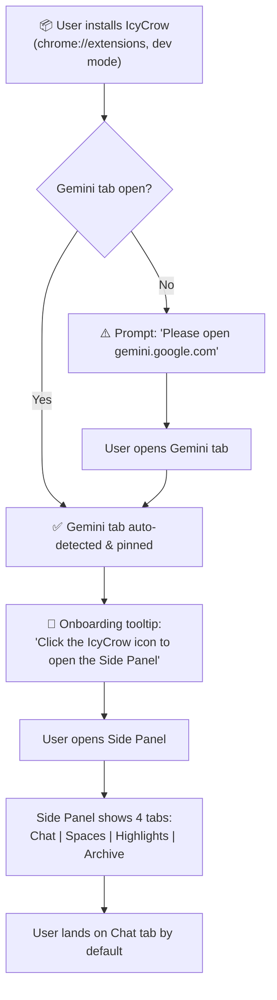
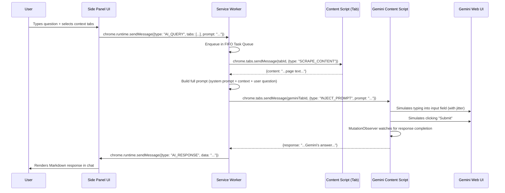

# IcyCrow — Product Requirements Document (PRD)

**Version:** 3.1 — Local-First Architecture (Audit Hardened)
**Date:** 2026-03-16
**Author:** AI-Generated (Principal Systems Architect & Lead PM)
**Status:** Draft v3.1 — Audit fixes applied for 22 findings

---

## Table of Contents

1. [Executive Summary](#1-executive-summary)
2. [Vision Formation & Success Definition](#2-vision-formation--success-definition)
3. [User Journey Visualization](#3-user-journey-visualization)
4. [Core Features (In-Scope MVP)](#4-core-features-in-scope-mvp)
5. [Out of Scope (Anti-Goals)](#5-out-of-scope-anti-goals)
6. [System Architecture & Data Flow](#6-system-architecture--data-flow)
7. [Security & Non-Functional Requirements](#7-security--non-functional-requirements)
8. [Technical & Practical Limitations](#8-technical--practical-limitations)
9. [Functionalities & Technologies Mapping](#9-functionalities--technologies-mapping)
10. [Vibe Coding Execution Plan (Vertical Slices)](#10-vibe-coding-execution-plan-vertical-slices)

---

## 1. Executive Summary

### Vision

**IcyCrow** is a Chrome extension that transforms the browser into an intelligent, AI-augmented workspace — without spending a single API dollar. By automating interaction with a pinned Google Gemini web tab, IcyCrow delivers powerful reasoning, cross-tab synthesis, and research automation capabilities while maintaining a privacy-first, local-only data architecture.

### Tagline

> *The Zero-Token, Memory-Efficient Browser Agent.*

### Value Proposition

| Problem | IcyCrow Solution |
|---|---|
| AI APIs are expensive for individual devs | **Zero-Cost Engine** — piggybacks on the free Gemini web UI |
| Too many open tabs destroy browser performance | **Dynamic Hibernation** — auto-discards inactive tabs, stays under 50 MB |
| Research context is scattered across dozens of tabs | **Multi-Tab Context Reasoning** — synthesizes content from any combination of open tabs |
| Saved research is hard to find later | **Semantic Search Archive** — vector-based "search by meaning" across all saved material |
| Privacy concerns with cloud AI tools | **Local-First Processing** — all data stays in `chrome.storage.local`; nothing leaves the machine |

### Target Users

- Individual developers and software engineers
- Technical researchers and students
- Power users who manage 20+ tabs daily

---

## 2. Vision Formation & Success Definition

### 2.1 What "Done" Looks Like for MVP

The MVP is **complete** when a single developer user can install IcyCrow in developer mode, open a Gemini tab, and — without any additional setup — execute the following end-to-end workflow:

1. Ask an AI question with multi-tab context and receive a rendered Markdown response.
2. Organise open tabs into a named Space, close the browser, and restore the entire Space with one click.
3. Highlight text across multiple pages and export consolidated Markdown notes.
4. Save an article and retrieve it later via a semantic (meaning-based) search query.
5. **Spatial PDF Annotation:** Perform tactile, pressure-sensitive markup on PDFs and export annotated binaries (Baked-in). ✅
6. **AI Bridge Stability:** Zero-duplication, background-resilient, and integrity-hardened AI interactions. ✅

If a user can do all four, the MVP ships.

### 2.2 Success KPIs

#### Practical KPIs (User-Outcome)

| # | KPI | Target | Measurement Method |
|---|---|---|---|
| P-1 | **Time-to-First-AI-Response** | ≤ 90 seconds from install | Stopwatch test: install → open Gemini → type question → see response |
| P-2 | **Space Restore Fidelity** | 100% of saved tabs restored | Automated test: save 10 tabs, close, restore, assert all 10 present |
| P-3 | **Semantic Search Relevance** | Top-3 results contain the correct article ≥ 80% of the time | Benchmark set of 50 query/article pairs |
| P-4 | **Highlight Persistence Rate** | 100% of highlights survive a full browser restart | Manual + automated test |
| P-5 | **Zero Data Leakage** | 0 outbound network requests (excl. Gemini tab) | Chrome DevTools Network tab audit; CSP violation log |

#### Technical KPIs (System Health)

| # | KPI | Target | Measurement Method |
|---|---|---|---|
| T-1 | **Extension Memory** | < 50 MB (excl. Gemini tab) | Chrome Task Manager snapshot with 30 open tabs |
| T-2 | **Message Latency** | < 100 ms (content script ↔ service worker) | `performance.now()` delta logged in service worker |
| T-3 | **Queue Throughput** | ≥ 10 sequential queries without failure | Automated stress test |
| T-4 | **IndexedDB Write Latency** | < 50 ms per article save | `performance.now()` around `transaction.oncomplete` |
| T-5 | **Unit Test Coverage** | ≥ 80% on all business-logic modules | Jest `--coverage` report |
| T-6 | **Build Size** | < 2 MB (excl. ONNX model) | `du -sh dist/` after production build |

---

## 3. User Journey Visualization

### 3.1 First-Time User Flow



### 3.2 Core Task Flow — AI-Augmented Research Session

```mermaid
flowchart TD
    START["🔍 User is researching a topic\nacross 5+ open tabs"] --> S1

    subgraph ORGANIZE ["① Organise"]
        S1["Click 'New Space' in Spaces tab"] --> S2["Name: 'ML Research'"]
        S2 --> S3["Current tabs auto-captured into Space"]
    end

    S3 --> S4

    subgraph ASK_AI ["② Ask AI"]
        S4["Switch to Chat tab"] --> S5["Click 'Select Tabs' → pick 2 tabs"]
        S5 --> S6["Type: 'Compare the approaches in these papers'"]
        S6 --> S7["⏳ Queue indicator shows 'Processing...'"]
        S7 --> S8["✅ Markdown response rendered with code blocks"]
    end

    S8 --> S9

    subgraph CAPTURE ["③ Capture"]
        S9["User reads a key paragraph on Tab 3"] --> S10["Selects text → Ctrl+Shift+H → Highlight saved"]
        S10 --> S11["Switches to Highlights panel → sees all highlights"]
        S11 --> S12["Clicks 'Send to Notes' on 2 highlights + AI response"]
        S12 --> S13["Edits in Markdown editor → Exports .md file"]
    end

    S13 --> S14

    subgraph ARCHIVE ["④ Archive"]
        S14["Clicks 'Save Page' on a key article"] --> S15["Article saved + AI summary generated"]
        S15 --> S16["Later: searches 'gradient descent convergence'"]
        S16 --> S17["Semantic search returns the saved article"]
    end

    S17 --> S18

    subgraph RESTORE ["⑤ Restore"]
        S18["User closes browser, goes home"] --> S19["Opens browser → IcyCrow Side Panel"]
        S19 --> S20["Clicks 'Restore' on 'ML Research' Space"]
        S20 --> S21["All 5 tabs restored (discarded state)"]
        S21 --> S22["User clicks a tab → it reloads with highlights intact"]
    end
```



### 3.3 Journey Annotations for AI Agents

> [!NOTE]
> Each numbered sub-flow (①–⑤) maps directly to an Epic and a Vertical Slice. When building a slice, refer back to this journey to understand **why** the feature exists and **when** the user encounters it.

| Journey Phase | Epic | Vertical Slice | Key Module |
|---|---|---|---|
| ① Organise | Epic 2 — Tab & Space Management | Slice 3 | `space-manager.js` |
| ② Ask AI | Epic 1 — Zero-Cost AI Engine + Epic 4 — Chat | Slice 2 + Slice 4 | `gemini-bridge.js`, `context-builder.js` |
| ③ Capture | Epic 3 — Capture & Process Engine | Slice 5 | `highlighter.js`, Markdown Notes Editor |
| ④ Archive | Epic 5 — Read-it-Later & Archive | Slice 6 | `article-saver.js`, `semantic-search.js` |
| ⑤ Restore | Epic 2 — Tab & Space Management | Slice 3 | `space-manager.js`, `hibernation-manager.js` |

---

## 4. Core Features (In-Scope MVP)

The MVP is organised into **five epics**. Each epic contains granular, actionable stories.

---

### Epic 1 — Zero-Cost AI Engine (The Core Bridge)

> **Goal:** Establish the foundational mechanism that makes every other feature possible — the bridge between user tabs and the Gemini web UI.

| # | Story | Acceptance Criteria |
|---|---|---|
| 1.1 | **Gemini Tab Detection** — Detect and auto-pin a Gemini web tab on extension load. | Extension identifies `gemini.google.com` tabs; user is prompted to open one if none exists. |
| 1.2 | **Context Injection** — Programmatically type user-selected context into the Gemini input field. | Uses `chrome.debugger` or content-script DOM manipulation with human-mimicry (jitter, random delays). |
| 1.3 | **Response Scraping** — Detect when Gemini finishes responding and extract the response text. | MutationObserver watches the response container; extracted Markdown is returned to the caller. |
| 1.4 | **Anti-Detection Engine** — Randomised typing delays (50–200 ms), mouse jitter, variable submission timing. | Configurable delay ranges in settings; no two interactions have identical timing signatures. |
| 1.5 | **FIFO Task Queue** — Queue multiple AI requests; process one at a time. | Queue UI shows pending/active/completed tasks; user can cancel or reorder pending items. |

---

### Epic 2 — Tab & Space Management

> **Goal:** Help users organise, save, and restore browsing sessions with minimal manual effort.

| # | Story | Acceptance Criteria |
|---|---|---|
| 2.1 | **Space CRUD** — Create, rename, delete, and list Spaces (groups of tabs). | ✅ COMPLETED |
| 2.2 | **One-Click Restore** — Restore all tabs in a Space. | ✅ COMPLETED |
| 2.3 | **Live Sync** — If a tab within a saved Space navigates to a new URL, update the Space automatically. | `chrome.tabs.onUpdated` listener compares against Space registry and patches matching entries. |
| 2.4 | **Dynamic Hibernation** — Auto-discard tabs inactive for a configurable threshold (default 15 min). | Uses `chrome.idle` + per-tab last-active timestamps. Discarded tabs remain in the tab strip. |
| 2.5 | **AI-Driven Tab Grouping** — Send tab titles/URLs to AI and receive suggested semantic "Stacks". | User can accept, modify, or reject suggestions; accepted stacks map to `chrome.tabGroups`. |

---

### Epic 3 — Capture & Process Engine

> **Goal:** Let users highlight, annotate, and convert web content into reusable knowledge.

| # | Story | Acceptance Criteria |
|---|---|---|
| 3.1 | **Text Highlighting** — Select text on any page; highlighted fragments are stored chronologically. | ✅ COMPLETED |
| 3.2 | **Sidebar Highlights Panel** — Chronological list of all highlights with source URL and timestamp. | ✅ COMPLETED |
| 3.3 | **Integrated Markdown Notes** — In-extension Markdown editor pre-populated from highlights and AI responses. | Supports headings, code blocks, lists; export to `.md` file. |
| 3.4 | **Web & PDF Annotator / Export** — Canvas overlay for freehand drawing, shapes, and sticky-note comments on web pages and PDFs. Physically flatten annotations into PDF binaries. | ✅ COMPLETED (S25-S29) |

---

### Epic 4 — Workspace-Aware AI Chat

> **Goal:** Provide a conversational AI interface that understands the user's current project context.

| # | Story | Acceptance Criteria |
|---|---|---|
| 4.1 | **Chat UI (Side Panel)** — Persistent side-panel chat interface. | ✅ IMPLEMENTED |
| 4.2 | **Multi-Tab Context Injection** — User selects 1-N tabs; their content is concatenated and sent as context to the Gemini prompt. | ✅ IMPLEMENTED |
| 4.3 | **Chat History per Space** — Each Space maintains its own chat history. | ✅ COMPLETED |
| 4.4 | **CLW (Command Line Workspace)** — `Ctrl+K` command palette for quick AI tasks, tab search, and Space switching. | Fuzzy search across tabs, Spaces, and chat history; supports `/commands` (e.g., `/summarise`, `/compare`). |

---

### Epic 5 — Smart Read-it-Later & Archive

> **Goal:** Save, index, and semantically search web content for offline retrieval.

| # | Story | Acceptance Criteria |
|---|---|---|
| 5.1 | **Contextual Save** — Save full-text content of a page + AI summary + user notes. | One-click save from toolbar or context menu; stored in IndexedDB. |
| 5.2 | **Semantic Search** — Vector-embed saved articles; search by meaning. | Uses a lightweight local embedding model (e.g., `all-MiniLM-L6-v2` via ONNX Runtime in a web worker). |
| 5.3 | **Offline AI Access** — Query archived material via a local LLM (Ollama). | Extension detects if Ollama is running on `localhost:11434`; falls back to Gemini tab if unavailable. |

---

## 5. Out of Scope (Anti-Goals)

> [!CAUTION]
> The following items are **explicitly excluded** from the MVP to prevent scope creep. They may be revisited in future releases.

| # | Anti-Goal | Rationale |
|---|---|---|
| 🚫 1 | **Any Cloud Backend / Server Infrastructure** | IcyCrow is 100% local-first. Zero remote servers, zero cloud databases, zero hosted authentication. All persistence is browser-local. |
| 🚫 2 | **Cloud-Based Authentication (OAuth, JWT against our servers)** | No user accounts. No login. The user’s Chrome profile IS their identity boundary. |
| 🚫 3 | **Mobile Browser Support** | Chrome extension APIs are desktop-only. No mobile shim. |
| 🚫 4 | **Support for AI providers other than Gemini** | The Zero-Cost Engine is purpose-built for Gemini’s DOM. Multi-provider support adds massive complexity. |
| 🚫 5 | **Monetisation / Payments / Subscription Tiers** | Build value first; monetise later. |
| 🚫 6 | **Real-Time Collaborative / Multi-User Workspaces** | Requires server-side state, permissions, and conflict resolution. Fundamentally incompatible with local-first. |
| 🚫 7 | **Browser Extension Store Publishing Pipeline** | Focus on local development and manual install (developer mode) for MVP. |
| 🚫 8 | **Visual Knowledge Map (2D Graph)** | Complex visualisation library dependency (e.g., D3/Cytoscape). Defer to v2. |
| 🚫 9 | **Select-Box & Ask AI (RPA)** | Screen-reading + headless automation is a high-risk, high-complexity feature. Defer to v2. |

### 5.1 Compromised Features — Serverless Strategies

> [!NOTE]
> The following features would traditionally require a cloud backend. Below is the **local-first product strategy** that solves these needs with zero infrastructure.

| Feature | Cloud Approach (Rejected) | Local-First Strategy |
|---|---|---|
| **Cross-Device Sync** | Cloud DB + real-time sync | ✅ IMPLEMENTED: **File-based Export/Import:** One-click export of entire workspace (Spaces, chat history, highlights, archive) to a single encrypted `.icycrow` bundle. (AES-GCM-256). |
| **Data Backup & Recovery** | Server-side automated backups | ✅ IMPLEMENTED: **Manual/Scheduled Backups:** One-click encrypted export via File System Access API (`showSaveFilePicker`). |
| **Data Sharing** | Shared workspace via collaboration server | **Selective Export:** User can export individual Spaces, highlight collections, or note bundles as `.icycrow` snippet files. Recipients import into their own extension instance. No real-time collaboration — asynchronous sharing only. |

---

## 6. System Architecture & Data Flow

### 6.1 High-Level Architecture

IcyCrow is a **Manifest V3 Chrome Extension** with the following process model:

```
┌───────────────────────────────────────────────────────────┐
│                    CHROME BROWSER                         │
│                                                           │
│  ┌─────────────┐   ┌─────────────┐   ┌───────────────┐   │
│  │  Content     │   │  Content     │   │  Content      │   │
│  │  Script      │   │  Script      │   │  Script       │   │
│  │  (Tab A)     │   │  (Tab B)     │   │  (Gemini Tab) │   │
│  └──────┬───────┘   └──────┬───────┘   └───────┬───────┘   │
│         │                  │                   │           │
│         ▼                  ▼                   ▼           │
│  ┌─────────────────────────────────────────────────────┐   │
│  │              SERVICE WORKER (Background)             │   │
│  │                                                     │   │
│  │  ┌──────────┐ ┌──────────┐ ┌──────────┐ ┌────────┐ │   │
│  │  │ AI Queue │ │ Space    │ │ Hibernate│ │ Archive│ │   │
│  │  │ Manager  │ │ Manager  │ │ Manager  │ │ Manager│ │   │
│  │  └──────────┘ └──────────┘ └──────────┘ └────────┘ │   │
│  │                      │                              │   │
│  │          ┌───────────┴───────────┐                  │   │
│  │          ▼                       ▼                  │   │
│  │  ┌──────────────┐    ┌───────────────┐              │   │
│  │  │chrome.storage│    │  IndexedDB    │              │   │
│  │  │   .local     │    │ (Full-text +  │              │   │
│  │  │ (Settings,   │    │  Vectors +    │              │   │
│  │  │  Spaces,     │    │  Annotations) │              │   │
│  │  │  Chat Hist.) │    │               │              │   │
│  │  └──────────────┘    └───────────────┘              │   │
│  └─────────────────────────────────────────────────────┘   │
│                           │                               │
│  ┌────────────────────────┴────────────────────────────┐   │
│  │              SIDE PANEL / POPUP UI                   │   │
│  │  (Chat, Highlights, Spaces, Notes, CLW, Settings)   │   │
│  └─────────────────────────────────────────────────────┘   │
│                                                           │
│  ┌─────────────────────────────────────────────────────┐   │
│  │   OPTIONAL: localhost:11434 (Ollama for offline AI)  │   │
│  └─────────────────────────────────────────────────────┘   │
└───────────────────────────────────────────────────────────┘
```

### 6.2 Component Responsibilities

| Component | Responsibility | Technology |
|---|---|---|
| **Service Worker** | Central message hub, manages all background logic, owns the FIFO queue | Manifest V3, `chrome.runtime` |
| **Content Scripts** | DOM scraping (page text, highlights), DOM injection (annotations, overlays) | Vanilla JS, injected per-tab |
| **Gemini Content Script** | Specialised content script for Gemini tab: types prompts, scrapes responses | DOM manipulation, `MutationObserver` |
| **Side Panel UI** | All user-facing chrome: Chat, Spaces, Highlights, Notes, Settings | HTML + CSS + Vanilla JS (or lightweight framework like Preact) |
| **chrome.storage.local** | Settings, Spaces, Chat histories, Highlights metadata | Key-value, synchronous-ish reads |
| **IndexedDB** | Full-text article archive, vector embeddings, annotation data | Structured, supports large blobs |
| **Web Workers** | Vector embedding computation (ONNX Runtime), heavy text processing | Off-main-thread processing |

### 6.3 Data Flow — AI Query Lifecycle



### 6.4 Database Schema (IndexedDB + chrome.storage)

#### `chrome.storage.local` — Lightweight, Frequently Accessed Data

```jsonc
// KEY: "spaces"
{
  "spaces": {
    "<space_id:uuid>": {
      "id": "uuid",
      "name": "Spring Boot Research",
      "createdAt": "ISO-8601",
      "updatedAt": "ISO-8601",
      "tabs": [
        {
          "id": "uuid",
          "url": "https://...",
          "title": "...",
          "favicon": "data:image/...",
          "scrollPosition": 0,
          "chromeTabId": null  // populated on restore
        }
      ]
    }
  }
}

// KEY: "chatHistories"
{
  "chatHistories": {
    "<space_id:uuid>": [
      {
        "id": "uuid",
        "role": "user" | "assistant",
        "content": "Markdown string",
        "timestamp": "ISO-8601",
        "contextTabIds": ["uuid", "uuid"]
      }
    ]
  }
}

// KEY: "settings"
{
  "settings": {
    "hibernation": {
      "enabled": true,
      "inactiveThresholdMinutes": 15
    },
    "antiDetection": {
      "typingDelayMin": 50,
      "typingDelayMax": 200,
      "jitterEnabled": true
    },
    "archive": {
      "embeddingModel": "all-MiniLM-L6-v2",
      "embeddingModelVersion": 1,
      "ollamaEndpoint": "http://localhost:11434"
    },
    "gemini": {
      "urlPattern": "*://gemini.google.com/*",
      "customUrl": null
    },
    "encryption": {
      "enabled": false,
      "autoLockMinutes": 30
    },
    "backup": {
      "enabled": true,
      "intervalDays": 7,
      "maxBackups": 5,
      "lastSuccessAt": null
    }
  }
}

// KEY: "highlights:<SHA256(canonicalUrl)>"  — one key per URL (hashed to avoid collisions)
{
  "highlights": [
    {
      "id": "uuid",
      "url": "https://...",
      "text": "selected text",
      "anchor": {
        "type": "TextQuoteSelector",
        "exact": "the selected text verbatim",
        "prefix": "50 chars before selection",
        "suffix": "50 chars after selection",
        "xpathFallback": "/html/body/div[2]/p[3]",
        "cssFallback": "div.article > p:nth-child(3)",
        "startOffset": 42,
        "endOffset": 67
      },
      "pageMeta": {
        "title": "Page Title",
        "domFingerprint": "SHA256 of first 500 chars of body.innerText"
      },
      "createdAt": "ISO-8601",
      "spaceId": "uuid | null"
    }
  ]
}
```

#### IndexedDB — `IcyCrowDB`

> [!NOTE]
> **Schema Migration Strategy (G-1):** IndexedDB uses integer versioning. The extension starts at version 1. Every schema change bumps the version. An `onupgradeneeded` handler runs sequential migration functions (v1→v2, v2→v3, etc.). All migration functions are preserved in `lib/idb-migrations.js` indefinitely.

| Object Store | Key Path | Indexes | Record Shape |
|---|---|---|---|
| `articles` | `id` | `url`, `savedAt`, `spaceId` | `{ id, url, title, fullText, aiSummary, userNotes, savedAt, spaceId, encrypted: bool }` |
| `embeddings` | `articleId` | `modelVersion` | `{ articleId, vector: Float32Array, modelVersion: int, createdAt }` |
| `annotations` | `id` | `url` | `{ id, url, type: "drawing"|"comment"|"shape", data: {...}, createdAt }` |
| `taskQueue` | `id` | `status`, `createdAt` | `{ id, prompt, contextTabs, status: "pending"|"active"|"completed"|"failed", result, createdAt }` |
| `onnxModelCache` | `modelName` | — | `{ modelName, modelData: ArrayBuffer, version: int, cachedAt }` |
| `backupManifest` | `id` | `createdAt` | `{ id, timestamp, fileSize, checksum, location }` |

---

## 7. Security & Non-Functional Requirements (Local-First Model)

> [!IMPORTANT]
> IcyCrow has **zero cloud infrastructure**. There are no remote servers, no hosted databases, and no user accounts. The security model is therefore fundamentally different from a SaaS application. The threat surface is the **user's local browser environment**, not the network.

### 7.1 Security Principles

| # | Principle | Implementation |
|---|---|---|
| **S-1** | **Absolute Data Locality** | ALL user data is stored exclusively in `chrome.storage.local` and IndexedDB. The extension makes **zero outbound network requests** except to: (1) the Gemini tab (same browser, via DOM), and (2) optionally `localhost:11434` (Ollama). No telemetry, no analytics, no third-party calls. |
| **S-2** | **At-Rest Encryption (Opt-In)** | Encryption is **opt-in**. By default, data is stored in plaintext. When the user sets a passphrase in Settings, sensitive data (articles, notes, annotations, chat histories) is encrypted with AES-GCM-256. The `CryptoKey` is derived via PBKDF2 (100,000 iterations, SHA-256) and held **only** in the Service Worker's closure scope — never serialised, never sent via `sendMessage()`. |
| **S-3** | **Encryption Key Lifecycle** | The derived `CryptoKey` is **auto-wiped** from memory after 30 minutes of idle (no storage operations). User must re-enter the passphrase to unlock. This limits the window of exposure if a content script is compromised. Per-record encryption is atomic (one record per `SubtleCrypto.encrypt()` call) to survive Service Worker termination. |
| **S-4** | **Passphrase Strength Enforcement** | Export/backup passwords enforce minimum 8 characters with at least 1 number and 1 special character. A strength meter is shown in the UI. At-rest encryption passphrases display a strength meter with a warning on weak passphrases but do not block (to reduce friction). |
| **S-5** | **Export/Backup Encryption** | `.icycrow` export files use AES-GCM-256 (authenticated encryption — the GCM tag provides integrity). The HMAC-SHA256 checksum covers the **unencrypted metadata** fields (format, version, exportedAt) to detect header tampering. Encryption key and HMAC key are derived from the same password using **separate PBKDF2 salts**. |
| **S-6** | **Content Security Policy** | Manifest declares strict CSP: `script-src 'self'; object-src 'none'; connect-src 'self' http://localhost:11434`. No inline scripts, no `eval()`, no remote script loading. |
| **S-7** | **Minimal Permissions** | Request only required Chrome permissions: `tabs`, `storage`, `unlimitedStorage`, `sidePanel`, `activeTab`, `scripting`, `idle`. No `<all_urls>` — use optional host permissions that the user grants per-site. |
| **S-8** | **Input Sanitisation** | All user-provided text (notes, highlights, chat input) is sanitised with DOMPurify before DOM injection. All AI-generated responses from the Gemini scrape are also sanitised to prevent injection (OWASP A7). |
| **S-9** | **No Remote Code Execution** | No dynamic script loading. All code is bundled at build time. No CDN loads, no `fetch()` for JS. Prevents OWASP A8. |
| **S-10** | **Chrome Profile as Identity Boundary** | There are no user accounts. The Chrome user profile is the security boundary. Switching Chrome profiles switches IcyCrow data completely. This leverages Chrome's existing isolation model. |
| **S-11** | **Bulk Crypto in Workers Only** | All bulk encryption/decryption (export, import, batch re-encryption) runs in `export-worker.js`, never in the Service Worker. This prevents MV3's 30-second idle termination from interrupting crypto operations and leaving data in a partially-encrypted state. |

### 7.2 Local-First Threat Model

| # | Threat | Attack Vector | Severity | Mitigation |
|---|---|---|---|---|
| **T-1** | **Physical Device Access** | Attacker gains access to the user's unlocked machine and reads IndexedDB directly. | 🟠 High | At-rest encryption (§7.1 S-2). Without the passphrase, raw IndexedDB entries are AES-GCM-256 ciphertext. Auto-lock wipes key from memory after 30 min idle. |
| **T-2** | **Malicious Extension Cross-Read** | Another installed extension attempts to read IcyCrow's storage. | 🟡 Medium | Chrome's extension sandboxing prevents cross-extension storage access by default. Each extension has its own isolated `chrome.storage.local` and IndexedDB namespace. No additional mitigation required. |
| **T-3** | **XSS via Scraped Content** | A malicious webpage contains script tags in its text that IcyCrow scrapes and renders in the Side Panel. | 🔴 Critical | DOMPurify sanitises ALL scraped content before rendering. CSP blocks inline script execution. Content scripts run in an isolated world, separate from the page's JS context. |
| **T-4** | **Gemini Response Injection** | Gemini's response contains malicious HTML/JS that IcyCrow renders in the chat panel. | 🔴 Critical | AI responses are scraped as text → sanitised with DOMPurify → rendered via `marked.js` with `sanitize: true`. No raw HTML injection path exists. |
| **T-5** | **Export File Tampering** | Attacker modifies a `.icycrow` export file and the user imports it. | 🟡 Medium | AES-GCM authentication tag rejects tampered ciphertext. HMAC-SHA256 (separate key) covers unencrypted metadata. Tampered files are rejected with specific error messages. |
| **T-6** | **Service Worker State Poisoning** | A compromised content script sends malformed messages to the Service Worker. | 🟡 Medium | The Service Worker validates ALL inbound messages against a strict schema (sender origin check + payload shape validation via Zod). Unknown message types are dropped. |
| **T-7** | **CryptoKey Exfiltration via Message Channel** | Compromised content script requests key material via `sendMessage()`. | 🟠 High | `CryptoKey` is non-extractable (`extractable: false` in `deriveKey()`). Even if referenced, it cannot be serialised or sent via `postMessage()`. No message handler ever returns key material. |
| **T-8** | **Storage Write Race Condition** | Rapid concurrent `chrome.storage.local` writes corrupt data (read-modify-write race). | 🟡 Medium | All writes to the same storage key are serialised through a per-key `Promise` chain mutex in the Service Worker. Concurrent writes queue rather than race. |

### 7.3 Anti-Detection & Rate Limiting

| # | Requirement | Implementation |
|---|---|---|
| **R-1** | **Human-Mimicry Typing** | Randomised per-character delay: `50 + Math.random() * 150` ms. Occasional "pauses" (300–800 ms) every 10–30 characters. |
| **R-2** | **Submission Jitter** | After typing, wait `500 + Math.random() * 1500` ms before clicking submit. |
| **R-3** | **Request Throttle** | Maximum 1 AI query processed at a time. Minimum 3-second cool-down between consecutive queries. |
| **R-4** | **FIFO Queue with Back-Pressure** | Queue depth capped at 20. New requests after cap are rejected with a user-visible warning. |
| **R-5** | **Retry with Exponential Back-Off** | If Gemini returns an error or rate-limit signal, retry up to 3 times with 5s → 15s → 45s delays. |

### 7.4 Non-Functional Requirements

| Category | Requirement | Target |
|---|---|---|
| **Performance** | Extension memory footprint (excl. Gemini tab) | < 50 MB |
| **Performance** | Message-passing latency (content script ↔ service worker) | < 100 ms |
| **Performance** | Time to render chat response after scrape completes | < 200 ms |
| **Performance** | Semantic search query time (10,000 articles) | < 500 ms |
| **Performance** | Embedding generation (single article, Web Worker) | < 2 seconds |
| **Performance** | Content script injection | Only injected into **active or recently-active tabs** (max ~10 concurrent instances). Hibernated/discarded tabs have no content script until activated via `chrome.tabs.onActivated`. |
| **Reliability** | Service worker crash recovery | Auto-restart; pending queue persisted in `chrome.storage.local` |
| **Reliability** | Auto-backup monitoring | `backup.lastSuccessAt` tracked. If last backup > 2× interval, warning banner shown. On handle permission loss, `chrome.notifications` prompts re-auth. Fallback: `chrome.downloads.download()` if File System Access API unavailable. |
| **Usability** | First-time setup steps | ≤ 3 (install, open Gemini tab, pin extension) |
| **Usability** | Zero-account design | No registration, no login. Works immediately on install. |
| **Usability** | Diagnostic export | "Export Debug Log" in Settings. Collects: storage key sizes (not values), IDB record counts, SW uptime/restart count, last 50 message types, ONNX model status, extension/Chrome/OS versions. |
| **Accessibility** | Keyboard navigation for all UI panels | Full `Tab`/`Enter`/`Esc` support; ARIA labels on all interactive elements |
| **Maintainability** | Module coupling | Each manager (AI, Space, Hibernate, Archive) is a self-contained ES module with a defined public API |
| **Testability** | Unit test coverage for business logic modules | ≥ 80% |

### 7.5 Data Sizing Estimates

> [!NOTE]
> These estimates help users understand storage capacity and inform the soft-cap warning threshold in Settings.

| Data Type | Avg. Record Size | 1,000 Records | 10,000 Records |
|---|---|---|---|
| Highlight (with TextQuoteSelector anchor) | ~2 KB | ~2 MB | ~20 MB |
| Article (full text + AI summary) | ~50 KB | ~50 MB | ~500 MB |
| Embedding (384-dim Float32Array) | ~1.5 KB | ~1.5 MB | ~15 MB |
| Chat message | ~1 KB | ~1 MB | ~10 MB |
| Space (10 tabs) | ~5 KB | ~5 MB | ~50 MB |
| **Total (power user: 1k articles, 5k highlights, 10k chats)** | | **~80 MB** | |

---

## 8. Technical & Practical Limitations

> [!WARNING]
> The following constraints are **hard platform or architectural limits** that every AI coding agent and human developer must architect around. Ignoring these will cause runtime failures, store rejections, or data loss.

### 8.1 Chrome Extension Platform Constraints

| # | Constraint | Impact | Mitigation |
|---|---|---|---|
| **L-1** | **Service Worker Idle Termination** — MV3 service workers are killed after ~30 s of inactivity, or 5 min of sustained activity. | FIFO queue state is lost on kill. Long-running AI interactions may be interrupted mid-response. | Persist queue state to `chrome.storage.local` on every state change. On `onStartup`, rehydrate and resume. Use `chrome.alarms` (min 1-min interval) as a heartbeat keep-alive for critical processing windows. |
| **L-2** | **`chrome.storage.local` Quota** — Default 10 MB (can request `unlimitedStorage` permission). | Highlights + chat histories + Space data can grow quickly. | Declare `unlimitedStorage` in `manifest.json`. Implement storage-usage dashboard in Settings; warn user at 80% of a soft cap (e.g., 500 MB). |
| **L-3** | **IndexedDB Storage** — No hard limit (quota managed by browser), but transactions block the main thread if misused. | Large article saves or bulk embedding writes can freeze the UI. | All IndexedDB operations run inside the Service Worker or Web Worker — never on the Side Panel main thread. Use small, batched transactions (≤ 50 records per transaction). |
| **L-4** | **Content Script Injection** — Cannot inject into `chrome://`, `chrome-extension://`, Chrome Web Store, or other restricted pages. | User will see "Cannot access this page" for some tabs. | Gracefully skip restricted URLs with a user-visible badge indicator. Filter these tabs from the "Select Tabs" context picker. |
| **L-5** | **Manifest V3 CSP** — `script-src 'self'` only. No `eval()`, no `unsafe-inline`, no remote script loading. | ONNX Runtime Web uses `eval()` in some builds; `marked.js` may use `new Function()`. | Use ONNX Runtime Web's **WASM-only** build (no eval). Verify `marked.js` version does not require `eval`. Bundle all dependencies at build time via Vite. |
| **L-6** | **`chrome.tabs.discard()` Limitations** — Cannot discard the active tab or pinned tabs. | Hibernation Manager cannot hibernate the user's current tab or the Gemini tab (pinned). | Exclude `active: true` and `pinned: true` tabs from hibernation candidates. |

### 8.2 Gemini Bridge Risks

| # | Risk | Severity | Mitigation |
|---|---|---|---|
| **L-7** | **Gemini DOM Structure Changes** — Google can change the Gemini web UI's HTML/CSS at any time, breaking selectors in `gemini-bridge.js`. | 🔴 Critical | Centralise all Gemini DOM selectors in a single `gemini-selectors.js` config file. Implement a **selector health-check** on bridge init: if expected elements are missing, surface a user-visible "Bridge Offline — Gemini UI may have changed" warning and disable AI features gracefully. |
| **L-8** | **Account Rate-Limiting / CAPTCHA** — Google may flag automated interaction patterns and present a CAPTCHA or rate-limit the account. | 🟠 High | Anti-Detection Engine (§7.2) mitigates this. Additionally, implement a **circuit breaker**: if 3 consecutive requests fail, pause the queue for 10 minutes and alert the user. Never auto-retry CAPTCHAs. |
| **L-9** | **Gemini Tab Closed Mid-Query** — User accidentally closes the Gemini tab while a query is in-flight. | 🟡 Medium | `chrome.tabs.onRemoved` listener detects Gemini tab closure. Mark the active task as `failed`, notify the user, and prompt to re-open a Gemini tab. Re-enqueue the failed task automatically. |

### 8.3 Performance & Scalability Constraints

| # | Constraint | Impact | Mitigation |
|---|---|---|---|
| **L-10** | **ONNX Model Size (~23 MB)** — `all-MiniLM-L6-v2` significantly inflates the extension bundle. | Slow initial load; high disk usage. | Load the ONNX model **lazily on first search**, not on extension install. Store the model in IndexedDB after first download. Show a one-time "Downloading search model..." progress bar. |
| **L-11** | **Cosine Similarity at Scale** — Brute-force cosine similarity over 10,000+ embeddings is O(n). | Semantic search degrades beyond ~15,000 articles. | For MVP, brute-force is acceptable (target < 500 ms for 10k articles). Post-MVP: integrate an approximate nearest-neighbour (ANN) index like HNSW, or paginate search results. |
| **L-12** | **Message Passing Serialisation** — `chrome.runtime.sendMessage` serialises payloads via the structured clone algorithm. Large payloads (e.g., full page text) incur serialisation cost. | Latency spike on large content scrapes (> 100 KB of text). | Chunk large payloads into ≤ 50 KB segments. Use `chrome.runtime.Port` for streaming large responses instead of one-shot `sendMessage`. |
| **L-13** | **No Server-Side Compute** — All processing (embeddings, encryption, search, text parsing) must run in the browser. | Heavy compute can freeze the UI if run on the main thread. | See §8.4 below — strict Web Worker offloading for all CPU-intensive operations. |

### 8.4 Heavy Client-Side Compute Strategy

> [!IMPORTANT]
> Since there is **no remote server** to offload compute, every CPU-intensive operation must be explicitly routed to a **Web Worker** or **Service Worker** to keep the Side Panel UI and content scripts completely non-blocking.

| Task | Compute Intensity | Execution Context | Strategy |
|---|---|---|---|
| **Vector Embedding Generation** | 🔴 Heavy (~1–2s per article) | Dedicated Web Worker (`embedding-worker.js`) | ONNX Runtime Web (WASM-only build) loads `all-MiniLM-L6-v2` once, keeps it in memory. Articles are sent to the worker via `postMessage()`. Embeddings are returned as `Float32Array` and stored in IndexedDB. |
| **Cosine Similarity Search** | 🟠 Medium (~100–500ms for 10k vectors) | Same Web Worker (`embedding-worker.js`) | Query embedding computed in-worker. Brute-force cosine similarity loops over IndexedDB cursor. Top-K results returned to the Service Worker. |
| **AES-GCM-256 Encryption/Decryption** | 🟡 Low–Medium (~5–50ms per record) | Service Worker | `SubtleCrypto` is hardware-accelerated in modern browsers. Encrypt/decrypt operations run in the Service Worker before IndexedDB writes. Batched for bulk export. |
| **Full Workspace Export** | 🔴 Heavy (depends on data volume) | Dedicated Web Worker (`export-worker.js`) | Reads all IndexedDB stores. Serialises to JSON. Encrypts with user password. Computes HMAC-SHA256 integrity signature. Returns Blob to Service Worker for File System Access API download. |
| **Full Workspace Import** | 🔴 Heavy | Dedicated Web Worker (`export-worker.js`) | Verifies HMAC signature. Decrypts with user password. Validates schema with Zod. Writes to IndexedDB in batched transactions (≤ 50 records). Reports progress via `postMessage()`. |
| **PDF Text Extraction** | 🟠 Medium | Dedicated Web Worker (`pdf-worker.js`) | Uses `pdf.js` (Mozilla’s PDF parser) in worker mode. Extracts text page-by-page. Returns concatenated text to Service Worker. |
| **Large Page Content Scraping** | 🟡 Low | Content Script → Service Worker | Content script extracts text synchronously (DOM is fast). Sends to Service Worker via `chrome.runtime.Port` in ≤ 50 KB chunks for streaming. |

```
UI Main Thread (Side Panel)        Service Worker              Web Workers
┌──────────────────────────┐    ┌──────────────────────┐    ┌──────────────────────┐
│  ZERO heavy compute.   │    │  Lightweight routing  │    │  ALL heavy compute   │
│  Renders UI only.      │    │  + state management   │    │  runs here.           │
│  Never blocks > 16ms.  │───▶│  + SubtleCrypto       │───▶│  • embedding-worker.js │
│                        │    │  + message validation │    │  • export-worker.js   │
│                        │◀───│                      │◀───│  • pdf-worker.js      │
└──────────────────────────┘    └──────────────────────┘    └──────────────────────┘
```

---

## 9. Functionalities & Technologies Mapping

> [!IMPORTANT]
> This section is the **explicit contract** between the PRD and the AI coding agent. For every feature, the exact technology, API, or library is specified so there is zero ambiguity about implementation.

### 9.1 Core Technology Stack

| Layer | Technology | Version / Spec | Role |
|---|---|---|---|
| Extension Platform | **Chrome Extensions Manifest V3** | MV3 | Runtime environment, permission model, service worker lifecycle |
| Build Tool | **Vite** | ≥ 5.x | Bundle, tree-shake, and output production-ready extension files |
| UI Framework | **Preact** | ≥ 10.x (~3 KB) | Lightweight JSX component model for Side Panel UI |
| Styling | **Vanilla CSS** + CSS Custom Properties | — | Theming (light/dark), no external CSS framework |
| Markdown Rendering | **marked.js** | ≥ 14.x | Convert AI responses and notes to rendered HTML |
| Syntax Highlighting | **highlight.js** | ≥ 11.x | Code block highlighting inside Markdown renders |
| Text Sanitisation | **DOMPurify** | ≥ 3.x | XSS prevention on all rendered user/AI content |
| Vector Embeddings | **ONNX Runtime Web** (WASM build) | ≥ 1.17 | Run `all-MiniLM-L6-v2` in a Web Worker for semantic search |
| Encryption | **Web Crypto API** (`SubtleCrypto`) | Browser-native | AES-GCM-256 encryption + PBKDF2 key derivation |
| Fuzzy Search | **Fuse.js** | ≥ 7.x (~5 KB) | CLW command palette fuzzy matching |
| Testing | **Vitest** + `jest-chrome` | ≥ 2.x | Unit tests with mocked Chrome APIs (Vite-native test runner) |
| Linting | **ESLint** + `eslint-plugin-jsdoc` | ≥ 9.x | Code quality and JSDoc enforcement |

### 9.2 Feature → Technology → Chrome API Matrix

| Feature | Primary Module | Chrome APIs Used | Libraries Used | Storage Target |
|---|---|---|---|---|
| Gemini Tab Detection | `gemini-detector.js` | `chrome.tabs.query`, `chrome.tabs.onCreated`, `chrome.tabs.onRemoved` | — | Service Worker state |
| Context Injection (typing into Gemini) | `gemini-bridge.js` | `chrome.scripting.executeScript`, `chrome.tabs.sendMessage` | — (raw DOM) | — |
| Human-Mimicry Typing | `anti-detection.js` | — | — (pure JS timers) | Settings from `chrome.storage.local` |
| Response Scraping | `gemini-bridge.js` | `MutationObserver` (DOM API) | — | — |
| FIFO Task Queue | `task-queue.js` | `chrome.storage.local` (persistence), `chrome.alarms` (keep-alive) | — | `chrome.storage.local` |
| Space CRUD | `space-manager.js` | `chrome.tabs.query`, `chrome.tabs.create`, `chrome.tabs.group` | — | `chrome.storage.local` |
| One-Click Restore | `space-manager.js` | `chrome.tabs.create({ discarded: true })` | — | `chrome.storage.local` |
| Live Sync | `space-manager.js` | `chrome.tabs.onUpdated` | — | `chrome.storage.local` |
| Dynamic Hibernation | `hibernation-manager.js` | `chrome.tabs.discard`, `chrome.idle.onStateChanged`, `chrome.tabs.onActivated` | — | `chrome.storage.local` |
| AI-Driven Tab Grouping | `space-manager.js` | `chrome.tabGroups.update`, `chrome.tabs.group` | — | `chrome.storage.local` |
| Content Scraping | `content-scraper.js` | `chrome.scripting.executeScript` | — (DOM heuristics) | — (transient) |
| Context Builder | `context-builder.js` | — | — | — (transient) |
| Chat UI | Side Panel components | `chrome.sidePanel.open` | Preact, marked.js, highlight.js, DOMPurify | `chrome.storage.local` |
| Chat History | Side Panel + service worker | `chrome.storage.local` | — | `chrome.storage.local` |
| Text Highlighting | `highlighter.js` | `chrome.scripting.executeScript` | — (Selection API, Range API) | `chrome.storage.local` |
| Markdown Notes | Side Panel component | — | marked.js, DOMPurify | `chrome.storage.local` |
| Article Saver | `article-saver.js` | `chrome.scripting.executeScript` | — | IndexedDB (`articles`) |
| Vector Embeddings | `embedding-worker.js` (Web Worker) | — | ONNX Runtime Web (WASM) | IndexedDB (`embeddings`) |
| Semantic Search | `semantic-search.js` | — | ONNX Runtime Web (query embed), cosine similarity (pure JS) | IndexedDB (read) |
| Local Encryption | `crypto-utils.js` | — | `SubtleCrypto` (browser-native) | — (wraps IndexedDB writes) |
| CLW Command Palette | `clw.js` | `chrome.tabs.query` | Fuse.js | — (transient) |
| Ollama Integration | `ollama-client.js` | — | `fetch` to `localhost:11434` | Settings from `chrome.storage.local` |
| Settings Panel | Side Panel component | `chrome.storage.local` | Preact | `chrome.storage.local` |

### 9.3 File Structure Contract

```
icycrow/
├── manifest.json
├── vite.config.js
├── package.json
├── src/
│   ├── background/
│   │   ├── service-worker.js          # Entry point, lifecycle, message router
│   │   ├── task-queue.js              # FIFO queue engine
│   │   ├── gemini-detector.js         # Detects / manages Gemini tab
│   │   ├── space-manager.js           # Space CRUD + Live Sync
│   │   ├── hibernation-manager.js     # Tab discard logic
│   │   ├── article-saver.js           # Save + summarise articles
│   │   ├── crypto-manager.js          # Key derivation, auto-lock, encrypt/decrypt
│   │   └── export-controller.js       # Orchestrates export/import via workers
│   ├── content-scripts/
│   │   ├── gemini-bridge.js           # Types into Gemini, scrapes response
│   │   ├── anti-detection.js          # Human-mimicry typing/clicking
│   │   ├── content-scraper.js         # Extracts clean text from pages
│   │   └── highlighter.js             # Text highlighting + TextQuoteSelector anchoring
│   ├── side-panel/
│   │   ├── index.html                 # Side Panel entry
│   │   ├── index.js                   # Preact app root
│   │   ├── index.css                  # Global styles + CSS custom props
│   │   ├── components/
│   │   │   ├── ChatPanel.jsx
│   │   │   ├── SpacesPanel.jsx
│   │   │   ├── HighlightsPanel.jsx
│   │   │   ├── ArchivePanel.jsx
│   │   │   ├── NotesEditor.jsx
│   │   │   ├── SettingsPanel.jsx
│   │   │   └── CLW.jsx                # Command palette overlay
│   │   └── hooks/
│   │       ├── useStorage.js
│   │       └── useQueue.js
│   ├── workers/
│   │   ├── embedding-worker.js        # ONNX Runtime Web (embed + search)
│   │   ├── export-worker.js           # Serialise, encrypt, sign backups
│   │   └── pdf-worker.js              # Mozilla pdf.js text extraction
│   ├── lib/
│   │   ├── storage.js                 # Abstraction over chrome.storage + IDB
│   │   ├── storage-mutex.js           # Per-key write queue (prevents races)
│   │   ├── idb-migrations.js          # Sequential IDB schema migration runner
│   │   ├── context-builder.js         # Concatenate + budget multi-tab context
│   │   ├── semantic-search.js         # Cosine similarity engine
│   │   ├── crypto-utils.js            # AES-GCM encrypt/decrypt + PBKDF2 wrappers
│   │   ├── gemini-selectors.js        # Centralised Gemini DOM selectors
│   │   ├── zod-schemas.js             # All message type Zod schemas
│   │   ├── url-utils.js               # Canonical URL normalisation + SHA256 hashing
│   │   └── diagnostics.js             # Debug log collector for export
│   └── assets/
│       └── icons/
├── tests/
│   ├── storage.test.js
│   ├── storage-mutex.test.js
│   ├── task-queue.test.js
│   ├── space-manager.test.js
│   ├── anti-detection.test.js
│   ├── semantic-search.test.js
│   ├── crypto-utils.test.js
│   └── idb-migrations.test.js
└── models/
    └── all-MiniLM-L6-v2/              # ONNX model files (lazy-loaded)
```

---

## 10. Vibe Coding Execution Plan (Vertical Slices)

> [!IMPORTANT]
> Each slice is a **self-contained, independently testable** unit of work. An AI coding agent should be able to complete and verify one slice before moving to the next. Slices are ordered by dependency — each builds on the previous.

---

### Slice 1 — Extension Skeleton & Storage Layer

**Goal:** Bootable extension with a working manifest, service worker lifecycle, and a fully abstracted storage layer.

#### Deliverables

| # | Deliverable | Details |
|---|---|---|
| 1 | `manifest.json` (MV3) | Permissions: `tabs`, `storage`, `sidePanel`, `activeTab`, `scripting`, `idle`. CSP configured. |
| 2 | Service Worker (`background.js`) | Registers `onInstalled`, `onStartup`. Initialises default settings in `chrome.storage.local`. Logs lifecycle events. |
| 3 | Storage Abstraction Module (`storage.js`) | Wrapper over `chrome.storage.local` and IndexedDB. Exposes: `get(key)`, `set(key, value)`, `delete(key)`, `getAll(storeName)`. Handles schema versioning for IndexedDB. |
| 4 | Side Panel Shell (`sidepanel.html/js/css`) | Empty side panel that opens on extension icon click. Displays "IcyCrow v0.1" header. |
| 5 | Unit Tests | Jest tests for `storage.js` — mock `chrome.storage.local` and IndexedDB. |

#### Verification

- Extension loads in `chrome://extensions` (developer mode) without errors.
- Side panel opens.
- `storage.js` tests pass.
- `chrome.storage.local` contains default settings after install.

---

### Slice 2 — Zero-Cost AI Engine (Gemini Bridge)

**Goal:** The extension can send a hardcoded prompt to the Gemini tab and display the response in the side panel.

#### Deliverables

| # | Deliverable | Details |
|---|---|---|
| 1 | Gemini Tab Detector (`gemini-detector.js`) | On extension load, scans for open Gemini tabs. If none found, prompts user. Stores `geminiTabId` in service worker state. |
| 2 | Gemini Content Script (`gemini-bridge.js`) | Injected into `gemini.google.com`. Listens for `INJECT_PROMPT` messages. Types prompt with human-mimicry delays. Clicks submit. Uses `MutationObserver` to detect response completion. Sends `AI_RESPONSE` back. |
| 3 | Anti-Detection Module (`anti-detection.js`) | Exports `humanType(element, text, options)` and `humanClick(element, options)` with configurable delay ranges. |
| 4 | FIFO Task Queue (`task-queue.js`) | In-memory queue backed by `chrome.storage.local` for persistence. Processes one task at a time. Emits events: `task:enqueued`, `task:started`, `task:completed`, `task:failed`. |
| 5 | Side Panel — Chat MVP | Text input + send button. Displays AI response as plain text. No Markdown rendering yet. |

#### Verification

- With a Gemini tab open, sending "What is 2+2?" from the side panel results in the correct response displayed.
- Queue correctly serialises two back-to-back requests.
- Anti-detection delays are measurably random (log timestamps).

---

### Slice 3 — Spaces & Tab Hibernation

**Goal:** Users can create, save, restore, and auto-hibernate tab groups.

#### Deliverables

| # | Deliverable | Details |
|---|---|---|
| 1 | Space Manager Module (`space-manager.js`) | CRUD operations for Spaces. Stores in `chrome.storage.local`. |
| 2 | Space UI (Side Panel Tab) | List view of Spaces. Create / Rename / Delete buttons. "Restore" button per Space. |
| 3 | One-Click Restore | Opens all tabs in a Space using `chrome.tabs.create({ active: false, discarded: true })`. |
| 4 | Live Sync Listener | `chrome.tabs.onUpdated` listener. If a tab's URL changes and it belongs to a Space, update the Space record. |
| 5 | Hibernation Manager (`hibernation-manager.js`) | Tracks per-tab last-active timestamps. On `chrome.idle` event or interval check, discards tabs exceeding the inactivity threshold. |
| 6 | Unit & Integration Tests | Space CRUD tests. Hibernation threshold logic tests (mock `chrome.tabs.discard`). |

#### Verification

- Create a Space with 5 tabs. Close all tabs. Restore. All 5 tabs re-appear (discarded state).
- Navigate one tab to a new URL → Space record reflects the updated URL (Live Sync).
- Set hibernation to 1 minute. Wait. Inactive tabs are discarded.

---

### Slice 4 — Multi-Tab Context & Rich Chat

**Goal:** Users can select specific tabs to include as context for AI queries. Chat renders Markdown with code syntax highlighting.

#### Deliverables

| # | Deliverable | Details |
|---|---|---|
| 1 | Content Scraping Script (`content-scraper.js`) | Injected on-demand into any tab. Extracts main text content (strips nav, ads, footers via heuristic selector exclusion). Returns clean text. |
| 2 | Context Builder (`context-builder.js`) | Concatenates scraped content from selected tabs. Enforces a character budget (configurable, default 30,000 chars). Truncates with `[TRUNCATED]` marker if over budget. |
| 3 | Tab Selector UI | In the chat side panel, a "Select Tabs" button opens a checklist of open tabs. User picks 1-N tabs to include as context. |
| 4 | Rich Markdown Chat Renderer | Replace plain-text chat rendering with a Markdown renderer (e.g., `marked.js` + `highlight.js`). Copy-to-clipboard button on code blocks. |
| 5 | Chat History Persistence per Space | Chat messages stored in `chrome.storage.local` under the active Space ID. Switching Spaces switches the chat thread. |

#### Verification

- Open 3 tabs (e.g., Wikipedia pages). Select 2 in the tab selector. Ask "Compare these two topics." AI response references content from both tabs.
- Markdown rendering: code blocks have syntax highlighting. Bold/italic/lists render correctly.
- Switch Space → chat history changes. Switch back → previous history restored.

---

### Slice 5 — Capture & Highlights Engine

**Goal:** Users can highlight text on any page, view highlights in a sidebar panel, and take Markdown notes.

#### Deliverables

| # | Deliverable | Details |
|---|---|---|
| 1 | Highlight Content Script (`highlighter.js`) | On text selection + keyboard shortcut (`Ctrl+Shift+H`), wraps selection in a `<mark>` element. Stores highlight metadata (text, surrounding context, URL, CSS selector path for re-rendering). |
| 2 | Highlights Panel (Side Panel Tab) | Chronological list of all highlights. Grouped by date. Click to jump to source tab/URL. Filter by search text. |
| 3 | Highlight Persistence | Highlights stored in `chrome.storage.local`. On page revisit, content script re-applies `<mark>` overlays using stored CSS selector paths. |
| 4 | Markdown Notes Editor | Built-in textarea-based editor with live preview. Pre-populated with selected highlights and AI chat responses via a "Send to Notes" action. Export as `.md` file. |

#### Verification

- Highlight 3 passages on different pages → all 3 appear in the Highlights panel.
- Close and re-open a page → highlights re-render.
- Create a note with highlights + an AI response → export downloads a valid `.md` file.

---

### Slice 6 — Read-it-Later Archive & Semantic Search

**Goal:** Users can save full pages to an indexed archive and search them by meaning, not just keywords.

#### Deliverables

| # | Deliverable | Details |
|---|---|---|
| 1 | Article Saver (`article-saver.js`) | Extracts full text + metadata from current tab. Sends to Gemini for AI summary. Stores article record in IndexedDB `articles` store. |
| 2 | Archive UI (Side Panel Tab) | List of saved articles with title, URL, date, and summary snippet. Search bar. |
| 3 | Vector Embedding Pipeline | Web Worker loads `all-MiniLM-L6-v2` ONNX model. On article save, computes embedding and stores in IndexedDB `embeddings` store. |
| 4 | Semantic Search Engine (`semantic-search.js`) | On search query, computes query embedding. Performs cosine similarity against all stored embeddings. Returns top-K results ranked by relevance. |
| 5 | Keyword Fallback | If embedding model fails to load, falls back to full-text keyword search via IndexedDB index. |
| 6 | Local Encryption | Articles and notes encrypted with AES-GCM-256 (`SubtleCrypto`) before writing to IndexedDB. Key derived from a user-set passphrase via PBKDF2. |

#### Verification

- Save 5 diverse articles. Search "machine learning performance optimization" → relevant article surfaces even if those exact words don't appear in the title.
- Encryption: Raw IndexedDB inspection shows ciphertext, not plaintext.
- Keyword fallback: Disable ONNX worker → search still returns keyword-matched results.

---

### Slice 7 — CLW Command Palette, Settings, & Polish

**Goal:** Power-user command palette, configurable settings panel, and UX refinements across all features.

#### Deliverables

| # | Deliverable | Details |
|---|---|---|
| 1 | CLW Command Palette (`clw.js`) | `Ctrl+K` opens an overlay palette. Fuzzy search across: open tabs, Spaces, chat history, saved articles. Supports `/commands`: `/summarise`, `/compare`, `/save`, `/hibernate`. |
| 2 | Settings Panel | UI for all configurable values: Hibernation threshold, Anti-Detection delays, Embedding model, Ollama endpoint, Encryption passphrase, Theme (light/dark). |
| 3 | Ollama Integration (`ollama-client.js`) | If Ollama is running at the configured endpoint, route archive queries to the local LLM instead of the Gemini tab. Auto-detect at startup; graceful fallback. |
| 4 | Error Handling & User Feedback | Global error boundary. Toast notifications for success/failure. Loading spinners during AI processing. Retry prompts on queue failures. |
| 5 | Accessibility Audit | All UI elements have ARIA labels. Full keyboard navigation. High-contrast mode support. Focus trapping in modals. |
| 6 | Performance Audit | Profile memory usage. Ensure < 50 MB target. Identify and eliminate memory leaks (e.g., detached DOM nodes in annotation layer). |

#### Verification

- `Ctrl+K` opens CLW. Type "Spring" → finds Space named "Spring Boot Research" and any matching tabs/articles.
- Change hibernation threshold in settings → timer adjusts immediately.
- Ollama running → archive search uses local LLM. Ollama stopped → seamlessly falls back to Gemini.
- Lighthouse accessibility score ≥ 90 for side panel.
- Memory profiler shows extension footprint < 50 MB with 30 tabs and 100 saved articles.

---

## Appendix A — Glossary


| Term | Definition |
|---|---|
| **Space** | A saved group of tabs (URLs, titles, positions) that represent a project or research session. |
| **Stack** | An AI-suggested semantic grouping of currently open tabs by topic. |
| **CLW** | Command Line Workspace — A `Ctrl+K` command palette for power users. |
| **Zero-Cost Engine** | The core mechanism that uses DOM automation on the Gemini web tab instead of paid API calls. |
| **Dynamic Hibernation** | Automatically discarding inactive tabs from RAM while keeping them in the tab strip. |
| **Discarded Tab** | A Chrome tab that exists in the UI but has been unloaded from memory. Reloads on click. |
| **Human-Mimicry** | Randomised timing patterns in automated typing/clicking to avoid bot detection. |

---

> **End of PRD v3.1 — Local-First Architecture (Audit Hardened)** — This document is the single source of truth for all IcyCrow development. AI coding agents should reference this document for requirements, architecture decisions, technology choices, and implementation order. There are **zero cloud dependencies**.
